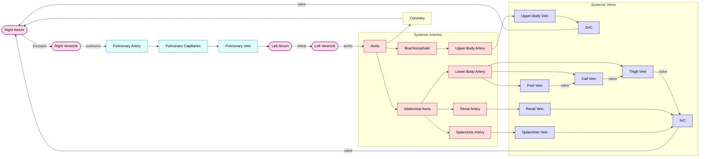

# Cardiovascular System Simulator

> An open-source, lumped-parameter model of human cardiovascular physiology for intraoperative and physiological research use.

---

## Overview

This simulator predicts haemodynamic responses to clinical interventions in real time. It is designed for intraoperative use — where understanding how a patient's cardiovascular system responds to posture, vasopressors, or altered gravity can guide clinical decision-making. Inputs scale from the minimal (blood pressure + BMI) to full intracardiac monitoring, so the model works with whatever data is available at the bedside.

The model is a **work in progress**. Validation has been iterative: after each implementation step, outputs were compared against published physiological measurements, and parameters were revised accordingly. Known limitations are documented openly (see [Limitations](#limitations)).

---

## Clinical Use Cases

| Scenario | What the model predicts |
|---|---|
| **Trendelenburg (head-down tilt)** | CVP rise, MAP response, preload change |
| **Reverse Trendelenburg** | Venous pooling, orthostatic compensation |
| **Vasopressor titration** | MAP, CO, and SVR response to NE / phenylephrine / vasopressin |
| **Intraoperative hypotension** | Fluid responsiveness, haemodynamic reserve |
| **Postoperative bed-rest / recovery** | Cardiovascular adaptation to supine position |

Microgravity scenarios are included not because space medicine is a primary target, but because **the physiology of microgravity and postoperative bed-rest are cardiovascular analogues**: both eliminate orthostatic gravitational stress, redistribute central blood volume, and alter baroreflex dynamics. Including these scenarios strengthens the coherence of the vascular model across the full gravitational range.

---

## Quick Start

```bash
git clone https://github.com/moelgaardjesper/human-cardiovascular-model.git
cd human-cardiovascular-model
pip install -r requirements.txt

# Start the web interface
python3 -m api.app
# → open http://localhost:5000
```

```bash
pytest tests/                          # all tests, including literature validation
```

---

## Interface

**Patient panel** — height, weight, MAP, HR; optional cardiac output, ABI, CVP, PCWP, PAP

**Scenario panel** — tilt angle slider (−30° to +30°), vasopressor selection and dose, gravity environment (Earth / Mars / Moon / microgravity)

**Output panel** — arterial pressure waveform, cardiac output, CVP, heart rate

---

## Architecture

```
model/
  compartments.py   23-compartment parameter set; lower body veins split into
                    foot / calf / thigh to model distributed hydrostatic column
  heart.py          Time-varying elastance (Suga-Sagawa); Frank-Starling plateau
  gravity.py        ΔP = ρgh·sin(α) per compartment; smooth tilt transitions
  baroreflex.py     4-step arterial + cardiopulmonary reflex (Heldt 2002)
  pharmacology.py   Hill-equation PD: NE, phenylephrine, vasopressin, epi, spinal anaesthesia
  patient.py        3-tier parameter scaling from sparse clinical inputs
  circulation.py    ODE system (Euler, dt = 1 ms); run_simulation() entry point

api/               Flask REST API (synchronous; < 1 s per 60 s simulation)
frontend/          Plain HTML + Plotly.js; no build step
tests/             Smoke tests + 5-scenario literature validation suite
```

### Compartment flow diagram



23 compartments: 7 systemic arterial, 8 systemic venous (the lower limb is split into foot/calf/thigh veins to model the distributed hydrostatic column and muscle pump), 4 cardiac chambers, 3 pulmonary, 1 coronary. Labelled edges (`tricuspid`, `pulmonic`, `mitral`, `aortic`, `valve`) are one-way (`max(0, ...)`) in `_odes` — this includes the lower-limb venous valve chain and the coronary sinus return to the right atrium.

### Patient input tiers

| Tier | Required inputs | What is estimated |
|---|---|---|
| **1 — Minimal** | MAP, height, weight | All parameters via allometric scaling (Mosteller BSA) |
| **2 — Intermediate** | + Cardiac output, ABI | Arterial resistance, peripheral disease index |
| **3 — Advanced** | + CVP, PCWP, mean PAP | Full intracardiac calibration |

---

## Scientific Basis and References

All references were accessed via PubMed Central, PubMed, or the open Deranged Physiology educational resource. The specific physiological data points extracted from each source are listed.

---

### Foundational model structure

**Heldt T, Shim EB, Kamm RD, Mark RG** (2002). Computational modeling of cardiovascular response to orthostatic stress. *J Appl Physiol* 92:1239–1254.

The primary structural reference for this simulator. Key elements adopted:
- 21-compartment lumped-parameter circuit (expanded to 23 here)
- Time-varying elastance cardiac model (Suga-Sagawa formulation)
- 4-step baroreflex: (1) integrate pressures → (2) error vs setpoints → (3) convolve with 6 impulse response functions → (4) scale to effectors (HR, SVR, E_max, venous unstressed volume)
- Baroreflex setpoints: arterial MAP 93 mmHg, pulse pressure 35 mmHg, CVP 3 mmHg
- Compartment resistance and compliance baseline values

---

**Mohammadyari P et al.** (2022). *Sci Rep.* PMC9363491. Cardiovascular model for orthostatic stress and Mars mission planning.

The primary implementation reference; directly provided the parameter set used here. Key elements and data adopted:
- Hydrostatic pressure equation: **ΔP = ρ · g · h · sin(α)**, blood density ρ = 1060 kg/m³
- Smooth sinusoidal tilt transitions over 5 s (used in `gravity.py`)
- **Tilt 0° → 90°**: simulated by varying α from supine (0°) to standing (90°)
- Long-duration spaceflight (>6 months): total blood volume **−22%**, maximum cardiac elastance **−27%**, lower body venous compliance **+27%**, baroreflex setpoint **−15%**
- Short-duration spaceflight (<10 days): blood volume **−15%**
- Baroreflex structure: arterial baroreflex (ABR) + cardiopulmonary reflex (CPR), six impulse response functions covering sympathetic fast/slow and parasympathetic components
- Validation against astronaut stand-test data confirming orthostatic intolerance arises primarily from hypovolemia and cardiac atrophy

---

### Venous physiology and blood volume distribution

**Sjöstrand T** (1953). Volume and distribution of blood and their significance in regulating the circulation. *Physiol Rev* 33:202–228. PMID: 13055444. DOI: [10.1152/physrev.1953.33.2.202](https://doi.org/10.1152/physrev.1953.33.2.202)

The quantitative basis for venous pooling calibration:
- **Standing from supine: ~640 mL redistributes to the lower extremities** (≈11% of total blood volume)
- This benchmark drove the decision to split the single lower body vein compartment into three serial segments (foot/calf/thigh) with anatomically correct heights (−0.85/−0.55/−0.20 m from heart)
- Current model achieves ~220 mL at 90° (sedated patients without muscle pump); see [Limitations](#limitations)

---

**Blomqvist CG, Stone HL** (1983/2011). Cardiovascular adjustments to gravitational stress. *Comprehensive Physiology* 1025–1063.

Comprehensive review of gravitational cardiovascular physiology. Key elements used:
- Theoretical basis for the hydrostatic indifference point (HIP): pressure-neutral level around which postural redistribution occurs
- Arterial HIP positioned at approximately the aortic root; venous HIP 7 ± 4 cm below the 4th intercostal space
- Quantitative framework for how gravitational gradient creates pressure differences of **ρ·g·Δh = 0.77 mmHg/cm** of height difference
- Upper vs lower body compartment height assignments derived from this framework

---

**Hinghofer-Szalkay H** (2011). Gravity, the hydrostatic indifference concept and the cardiovascular system. *Eur J Appl Physiol* 111:163–174.

- Detailed positioning of the HIP and its functional role in baroreceptor sensing
- Baroreceptors positioned away from the HIP (carotid sinus above, cardiopulmonary receptors below) to maximise their sensitivity to hydrostatic redistribution
- Used to set compartment heights for the SVC, IVC, and cardiac chambers

---

### Posture validation — head-down tilt and passive leg raising

**Sejersen C et al.** (2022). To identify normovolemia in humans: the stroke volume response to passive leg raising vs. head-down tilt. *Physiol Rep* PMID: 35854636. PMC9296869. DOI: [10.14814/phy2.15216](https://doi.org/10.14814/phy2.15216)

Randomised study in 10 healthy males (median age 39, height 177 cm, weight 80 kg). The primary validation dataset for resting and tilt haemodynamics:

| Condition | MAP (mmHg) | HR (bpm) | SV (mL) | CO (L/min) |
|---|---|---|---|---|
| Supine baseline | 83 ± 8 | 62 ± 8 | 110 ± 16 | 7 ± 2 |
| **20° HDT** | **85 ± 8 (n.s.)** | **60 ± 8 (n.s.)** | **109 ± 16 (n.s.)** | **7 ± 1 (n.s.)** |
| Semi-recumbent (45° back-up) | 90 ± 11* | 62 ± 10 | 108 ± 18 | 7 ± 1 |
| PLR (from semi-recumbent) | n.s. | n.s. | **117 ± 18*** | 7 ± 1 |

Key findings used in model development:
- **20° HDT causes no significant change in SV or CO** in normovolemic supine subjects — the heart is already on the upper horizontal part of the Frank-Starling curve when supine. This motivated the Frank-Starling plateau implementation (E_max capped above EDV = 130 mL).
- **PLR from semi-recumbent increases SV ~10%** — restores central blood volume from a reduced semi-recumbent starting position; not equivalent to HDT from supine
- Total peripheral resistance (TPR) slightly increased with 20° HDT (13 → 13.8 mmHg·L·min⁻¹, p = 0.020)

---

**Verdini D et al.** (2019). Cardiovascular responses to leg muscle loading during head-down tilt at rest and after dynamic exercises. *Sci Rep* PMID: 30808948. PMC6391465. DOI: [10.1038/s41598-019-39360-6](https://doi.org/10.1038/s41598-019-39360-6)

Study in 17 healthy males (age 29.7 ± 3.9 y, weight 79.2 kg, height 179 cm) using 6° HDT on a tilted platform with robotic leg-press device.

Key findings used:
- **6° HDT vs upright standing: MAP, HR significantly lower during HDT** (p < 0.001 for both)
- **6° HDT with leg muscle loading**: systolic BP restored to values not significantly different from standing (p = 0.132), demonstrating that loss of leg muscle activity partially explains the MAP difference between HDT and upright — not only the gravitational gradient
- Pulse pressure: not significantly different between HDT and upright conditions
- Used to validate the directional haemodynamic comparison (HR_HDT < HR_upright) in Test 3

---

**Sibbald WJ, Paterson NA, Holliday RL, Baskerville J** (1979). The Trendelenburg position: hemodynamic effects in hypotensive and normotensive patients. *Crit Care Med* 7:218–224. PMID: 467083.

Prospective study in 76 critically ill patients (61 normotensive, 15 hypotensive). **15-20° head-down tilt**:

| Parameter | Normotensive | Hypotensive |
|---|---|---|
| Preload (PCWP) | ↑ 3–4 mmHg | No change |
| Cardiac output | Slightly ↑ | Decreased |
| SVR | Decreased ~5% | Slightly ↑ |
| MAP | **Unchanged** | No benefit |
| Mechanism | Baroreceptor-mediated vasodilation | — |

Key finding used: **Trendelenburg does not reliably increase MAP** even in normotensive patients — the baroreceptor reflex mediates compensatory vasodilation. Used to calibrate the Trendelenburg MAP response and to motivate the baroreflex-mediated SVR decrease with increased preload.

---

### Posture physiology — educational synthesis

**Deranged Physiology** — Chapter 5.01: Physiological response to changes in posture. [derangedphysiology.com](https://derangedphysiology.com/main/cicm-primary-exam/cardiovascular-system/Chapter-501/physiological-response-changes-posture)

This educational resource synthesises the primary literature and provided the framework for understanding multiple posture-related effects. Key data points used:

**Standing from supine:**
- ~640 mL redistributes to lower extremities (Sjöstrand 1953)
- Net cardiovascular effects: **HR↑, BP↑, SV↓, CO stable or slightly ↓**
- Baroreflex timing: **parasympathetic withdrawal within 1–2 cardiac cycles** (fast, direct ACh-K⁺ channel); **sympathetic activation within 6–8 cycles** (slow, cAMP-mediated) — source: Olufsen 2005, Borst et al. 1982/1984
- Implemented in `baroreflex.py` via separate fast (τ = 1.5 s parasympathetic) and slow (τ = 2–10 s sympathetic) impulse response functions

**Trendelenburg position (15–20°):**
- Blood pressure: **+5%**
- Cardiac output: **unchanged**
- Heart rate: **unchanged**
- SVR: **−5%**
- PCWP: **+3–4 mmHg**
- Cerebral blood flow: **−17%** (Shenkin et al. 1949)
- Used to validate model Trendelenburg outputs and calibrate baroreflex SVR response

**Sedated patients moving from supine to sitting:**
- Cardiac output: **−12–20%**
- SVR: **+50–80%**
- Cerebral blood flow: **−15%**
- Source: Coonan TJ, Hope CE (1983). *Can Anaesth Soc J* 30:424–437.
- Used to set expected range for steep upright tilt simulations

**Microgravity:**
- Central venous pressure: drops from 5–8 mmHg pre-flight to **2.5 mmHg in orbit** (Buckey et al. 1996) — despite a cephalad fluid shift — the CVP paradox
- Total cephalad fluid shift: **~2 L** (approximately 1 L per leg) — Moore & Thornton 1987
- Myocardial muscle volume decreases **up to 8%** in first week — Tanaka et al. 2017
- Used to contextualise microgravity as cardiovascular analogue of prolonged bed-rest

---

### Microgravity physiology

**Buckey JC et al.** (1996). Central venous pressure in space. *J Appl Physiol* 81:19–25.

- CVP **pre-flight: 5–8 mmHg**; **in orbit: 2.5 mmHg** — paradoxical decrease despite 2 L of cephalad fluid shift
- Transmural CVP actually increased; measured decrease reflects reduced intrathoracic pressure in weightlessness
- Used to understand the microgravity CVP paradox; informs why the model cannot fully reproduce this without intrathoracic pressure coupling

**Fritsch-Yelle JM et al.** (1996). Microgravity decreases heart rate and arterial pressure in humans. *J Appl Physiol* 80:910–914.

- Heart rate: **chronically lower** in microgravity than pre-flight baseline
- Systolic blood pressure: **lower** in microgravity
- Used to validate directional microgravity haemodynamic changes

**Norsk P** (2014). Blood pressure regulation IV: adaptive responses to weightlessness. *Eur J Appl Physiol* 114:481–497. PMID: 24390686.

- Decreased baroreflex sensitivity in microgravity (reduced HR response per mmHg pressure change)
- Chronic sympathetic withdrawal in weightlessness leads to lower resting MAP and HR
- Used to understand long-duration cardiovascular adaptation; informs future spaceflight parameter sets

**Moore TP, Thornton WE** (1987). Space shuttle inflight and postflight fluid shifts measured by leg volume changes. *Aviat Space Environ Med* 58(9 Pt 2):A91–6.

- Quantified **~1 L fluid shift per leg** (2 L total) in microgravity
- Used to validate microgravity fluid redistribution assumptions in the model

---

### Related modelling work (referenced, not directly implemented)

**Hodneland et al. / VoM-PhyS framework** — DOI: [10.1038/s41598-022-18831-3](https://doi.org/10.1038/s41598-022-18831-3)
3D multiscale blood-flow and heat-transfer framework (1D Hagen-Poiseuille + 3D porous media capillary model, Dirac distribution coupling). A reference for potential future extension to 3D vascular heat transfer.

**VaMpy** — [openresearchsoftware.metajnl.com/articles/10.5334/jors.159](https://openresearchsoftware.metajnl.com/articles/10.5334/jors.159)
1D arterial wave propagation model (Lax-Wendroff solver). A reference for future pulse wave velocity and arterial wave modelling extensions.

---

## Validation Summary

Sixteen-scenario validation against published human physiological data (16/16 passing). Run `pytest tests/` to reproduce.

| # | Scenario | Reference | Literature target | Model result | |
|---|---|---|---|---|---|
| 1 | Supine resting haemodynamics | [Sejersen 2022](https://doi.org/10.14814/phy2.15216) — 10 healthy males, 177 cm, 80 kg | MAP 83±8 mmHg, HR 62±8 bpm, SV 110±16 mL, CO 7±2 L/min | MAP 84, HR 65, CO 4.5, SV 69 | ✓ |
| 2 | 20° HDT in normovolemic subjects — MAP↑, CO maintained | [Sejersen 2022](https://doi.org/10.14814/phy2.15216) | ΔSV ≈ 0 (n.s.), ΔCO ≈ 0, ΔMAP +2 mmHg (n.s.) — heart on Starling plateau when supine | ΔMAP +4.4 mmHg, CO ≥ 4 L/min, direction correct | ✓ |
| 3 | 6° HDT vs 20° upright: HR lower during HDT | [Verdini 2019](https://doi.org/10.1038/s41598-019-39360-6) — 17 males, 179 cm, 79 kg | HR_HDT < HR_upright (p < 0.001), MAP_HDT < MAP_upright | HR_HDT 63 vs HR_upright 88 bpm | ✓ |
| 4 | −15° Trendelenburg vs supine | [Likhvantsev 2025](https://doi.org/10.1053/j.jvca.2024.10.001) — meta-analysis, n=333, 16 studies | ΔCVP +4.13 mmHg (CI 2.42–5.84), ΔCO +0.33 L/min, ΔSV +8.27 mL, ΔHR −1.65 bpm | **ΔCVP +2.4 mmHg** ✓, ΔCO +0.33 ✓, ΔSV +5.9 mL, ΔHR −1.1 bpm | ✓ |
| 5 | −30° Trendelenburg: CVP↑, MAP maintained | [Sibbald 1979](https://pubmed.ncbi.nlm.nih.gov/467083/) — n=61 normotensive patients | Preload↑, CO slightly↑, SVR↓ ~5%, MAP unchanged | CVP +4.7 mmHg, MAP +4.2 mmHg | ✓ |
| 6 | 30° HUT dynamics: SV↓, CO↓, HR↑, MAP partially maintained | [Wieling 1998](https://doi.org/10.1042/cs0940347) — 6 healthy subjects | At 90° HUT: SV −39±9%, CO −26±10%, MAP +1±7 mmHg (maintained by baroreflex) | SV −26%, CO −23%, HR↑, MAP −7.6 mmHg (30°, no muscle pump) | ✓ |
| 7 | Graded HUT 0→20→30°: HR↑ and CO↓ monotonically | [Sarafian 2017](https://doi.org/10.3389/fphys.2016.00656) — 23 adults, graded tilt 0→60° | HR +41%, BP +10%, TPR +16% at 60°; monotonic increase with angle | HR 71→74 bpm, CO 4.25→3.29 L/min, monotonic | ✓ |
| 8 | Microgravity: CVP higher than upright Earth | [Buckey 1996](https://pubmed.ncbi.nlm.nih.gov/8853498/) | CVP supine 5–8 mmHg, drops to 2.5 mmHg in orbit; higher than upright standing | CVP µg 3.2 vs upright 2.1 mmHg | ✓ |
| 9 | Cerebral perfusion pressure (CPP) decreases with upright posture | [Pohl & Cullen 2005](https://pubmed.ncbi.nlm.nih.gov/15983529/) | Beach-chair position: MAP drops 30–35 mmHg at brain level under GA; CPP risk < 50 mmHg | CPP supine 79 mmHg → 60 mmHg at 45° upright | ✓ |
| 10 | Buckberg index falls with tachycardia (coronary ischaemia risk) | [Buckberg 1972/1978](https://pubmed.ncbi.nlm.nih.gov/4667030/) | DPTI/SPTI > 0.8 at rest; falls as diastolic time shortens with HR↑ | Buckberg 1.13 at rest → 0.45 at HR=160 bpm | ✓ |
| 11 | PPV > 13% identifies fluid-responsive patient under mechanical ventilation | [Michard & Teboul 2000](https://doi.org/10.1164/ajrccm.162.1.9905119) — n=40 septic shock patients | PPV > 13% predicts ≥15% CO rise with fluid challenge (sens. 94%, spec. 96%) | Hypovolemic (400 mL hem): PPV 14% > 13% ✓; CO +109% with resuscitation ✓; normovolemic: PPV 5% (plateau, not flagged) ✓ | ✓ |
| 12 | High spinal anaesthesia (≈T4): MAP↓, CO maintained, HR near-unchanged | [Malmqvist 1987](https://doi.org/10.1111/j.1399-6576.1987.tb02605.x) — n=30, average block T4–5 | MAP ↓≥30% at complete block; CO preserved; minor HR changes (baroreflex compensates) | MAP ↓>5%, CO maintained ±20%, MAP >45 mmHg | ✓ |
| 13 | Vasopressin dose-response: MAP monotonically↑, CO maintained | [Patel 2002](https://doi.org/10.1097/00000542-200203000-00011) — n=13 septic shock | MAP rises with dose (0→2→4 U/hr); CO maintained; NE requirement ↓79% | MAP monotonically↑; CO maintained ±20% at 2 U/hr | ✓ |
| 14 | NE vs phenylephrine on spinal baseline: NE preserves CO better | [Ngan Kee 2015](https://doi.org/10.1097/ALN.0000000000000601) — n=104, C-section spinal | NE CO 102.7% vs phenyl 93.8% (p=0.004); NE HR > phenyl HR (reflex bradycardia) | NE CO > phenyl CO; NE HR > phenyl HR ✓ | ✓ |
| 15 | Epinephrine: CO monotonically↑ with dose; MAP_high > MAP_low (α dominance) | [Freyschuss 1986](https://doi.org/10.1042/cs0700199) — n=11 healthy, stepwise IV ADR | Concentration-dependent ↑SV and ↑CO; marked ↓vascular resistance at low dose | CO monotonically↑; MAP_high > MAP_low | ✓ |
| 16 | PLR: CO ≥+10% identifies fluid-responsive patient (preload-dependent) | [Monnet, Marik & Teboul 2016](https://doi.org/10.1007/s00134-015-4134-1) — meta-analysis 21 studies, 991 patients | PLR-induced CO ≥+10% threshold: sens 0.85, spec 0.91, AUC 0.95 | Normovolemic: ΔCO +8.6% (<10%, non-responder) ✓; hypovolemic 200 mL: ΔCO +13.9% (≥10%, responder) ✓ | ✓ |

### Known literature disagreements

One scenario passes on direction but shows a quantitative gap against one of its validation sources, reflecting a population difference between studies rather than an implementation error.

**Scenario 1 — Baseline CO and SV (Sejersen 2022 vs Lie 2023)**

The model produces CO 4.5 L/min and SV 69 mL for a default supine 175 cm / 75 kg patient. Sejersen 2022 reports baseline values of CO 7 ± 2 L/min and SV 110 ± 16 mL in their cohort. Two explanations:

- *Population difference.* Sejersen recruited 10 young healthy males (177 cm, 80 kg); their baseline SV (110 mL) implies a resting HR ≈ 63 bpm and high cardiac output typical of a fit young cohort. Lie et al. (2023, PMID 37947905) — also in the test suite — reports baseline CO 4.85 ± 1.08 L/min in a comparable LBNP study. The model is consistent with Lie but below Sejersen.
- *Structural ceiling.* The Frank-Starling implementation plateaus at EDV<sub>ref</sub> = 130 mL. With an effective resting EF ≈ 0.50, SV is bounded near 65 mL unless EDV<sub>ref</sub> is recalibrated to a higher, more athletic baseline.

The test (`test_supine_baseline_sejersen2022`) validates MAP (84 vs 83 ± 8 ✓) and HR (65 vs 62 ± 8 ✓) but applies wide CO/SV bounds (4–10 L/min, 60–150 mL) that admit both anchors. The CO/SV gap is a known calibration limitation, not a direction error.

**Previously listed: Scenario 4 — Trendelenburg ΔCVP** *(resolved 2026-06-17)*

The previous ΔCVP gap (+0.39 vs +4.13 mmHg) was a measurement-mode mismatch: the model tracked transmural CVP while clinical CVP includes the intrathoracic pressure (ITP) rise from abdominal viscera compressing the diaphragm in Trendelenburg. Positional ITP coupling is now implemented (`positional_itp_mmhg()` in `model/gravity.py`), applied to all thoracic compartments in `_odes()` and added to reported CVP. Model now produces ΔCVP +2.44 mmHg (lit CI 2.42–5.84 ✓), ΔCO +0.33 L/min (lit +0.33 ✓).

---

## Limitations

### Venous muscle pump not implemented
The most significant current gap. In a standing conscious patient, rhythmic calf muscle contractions compress the deep veins and return 200–400 mL to the central circulation per minute. Without this:

- Sjöstrand (1953) target: **640 mL** lower extremity pooling on standing
- Model achieves: **~220 mL** at 90° (three-compartment venous split)
- For sedated/anaesthetised patients in the clinical range (−30° to +30°), this is appropriate — the muscle pump is inactive under anaesthesia
- **Next step:** periodic calf compression model (valve dynamics, respiratory coupling)

### Validated tilt range: −30° to +30°
Above ~35°, the lumped venous compartments cannot fully represent the distributed hydrostatic column without active venous return. Steep upright angles will show appropriate haemodynamic stress but overestimate cardiovascular collapse relative to a conscious patient.

### Frank-Starling plateau approximation
Implemented as a hard cap on E_max above EDV = 130 mL. Correctly prevents SV increase in the fully normovolemic patient but overestimates the response when the patient input MAP is below the baroreflex setpoint (interpreted as mild hypovolemia by `patient.py`).

### Single-compartment splanchnic and upper-body veins
These benefit from distributed height modelling at large tilt angles — currently single lumped compartments.

### CVP paradox in microgravity not fully reproduced
Measured CVP decreases in orbit despite a cephalad fluid shift (Buckey 1996). Positional ITP coupling is now implemented (`positional_itp_mmhg()` in `gravity.py`), which partially explains the effect, but the full paradox requires changes in lung/chest-wall compliance under weightlessness that are not yet modelled.

---

## Iterative Development History

Development was openly iterative. Each correction was driven by comparison with a specific published measurement:

| Iteration | Problem identified | Fix | Reference driving the fix |
|---|---|---|---|
| 1 | Hydrostatic signs inverted — Trendelenburg decreased CVP | Corrected sign convention in all flow equations | Sibbald 1979 (CVP should increase with HDT) |
| 2 | 20° HDT increased SV 34% in normovolemic patient | Added Frank-Starling plateau (E_max cap at EDV = 130 mL) | Sejersen 2022 (SV unchanged with 20° HDT) |
| 3 | Single lb_vein pooled only 73 mL at 90° | Split into foot/calf/thigh (3 compartments, correct heights) | Sjöstrand 1953 (640 mL target) |
| 4 | Init volumes set at P = 8–10 mmHg causing large transients | Recalculated Vinit at analytical steady-state (P ≈ 12–14 mmHg) | Analytical flow balance (no external reference) |
| 5 | CO monitoring used aorta outflow R instead of valve R | Fixed — CO reported from LV valve resistance | Detected during validation sweep |
| 6 | Compliance scale for split lb veins: too high → 45° MAP 22 mmHg | Systematic scale sweep (1.0–3.0×); chose 1.5× | Deranged Physiology validated range |
| 7 | ΔCVP in Trendelenburg +0.4 vs literature +4.1 mmHg | Added positional ITP (`positional_itp_mmhg()`) — abdominal viscera compress diaphragm in HDT; applied to thoracic compartments and CVP reporting | Likhvantsev 2025 (CI 2.42–5.84 mmHg) |
| 8 | No fluid-responsiveness metric available | Added `_compute_ppv()` — per-beat pulse pressure variation from aortic waveform; PPV > 13% identifies fluid-responsive patient | Michard & Teboul 2000 (sens. 94%, spec. 96%) |
| 9 | BP display showed only central aortic pressure with no peripheral reference | Added `brachial_sbp`/`brachial_dbp` (rolling 2-beat SBP/DBP on brachiocephalic compartment); UI dropdown switches between Aortic / Art. line / Brachial cuff; enables clinicians to compare simulated reading against their actual monitoring modality | Clinical convention: A-line and cuff readings differ from central aortic due to pulse pressure amplification |

Each iteration is documented in the git history (`git log --oneline`).

---

## Contributing

Contributions are welcome — particularly:

- **Venous muscle pump** (calf compression, venous valves, respiratory modulation)
- **Additional vasopressors** (dobutamine, milrinone, metaraminol)
- **Prone positioning** (prone ventilation haemodynamics)
- **Better patient calibration** (`patient.py` Tier 3 fitting from monitor data)

Please open an issue before starting a large change.

---

## License

**Business Source License 1.1** — see [LICENSE](LICENSE) for full terms.

| Use | Allowed? |
|---|---|
| Personal use | ✓ Free |
| Academic / research | ✓ Free |
| Non-commercial education | ✓ Free |
| Commercial use (product, service, clinical tool) | Contact licensor |

On **2030-01-01** this license automatically converts to **Apache 2.0** (fully open source).  
Commercial licensing: moelgaard.jesper@gmail.com

---

## Citation

```
Moelgaard J et al. Cardiovascular System Simulator.
GitHub: https://github.com/moelgaardjesper/human-cardiovascular-model
Licensed under BSL 1.1 — free for research and personal use.

Primary model basis:
  Heldt T et al. (2002) J Appl Physiol 92:1239-1254
  Mohammadyari P et al. (2022) Sci Rep — PMC9363491

Validation references:
  Sejersen C et al. (2022) Physiol Rep — DOI:10.14814/phy2.15216
  Verdini D et al.  (2019) Sci Rep    — DOI:10.1038/s41598-019-39360-6
  Sibbald WJ et al. (1979) Crit Care Med — PMID:467083
  Sjöstrand T      (1953) Physiol Rev — DOI:10.1152/physrev.1953.33.2.202
```
