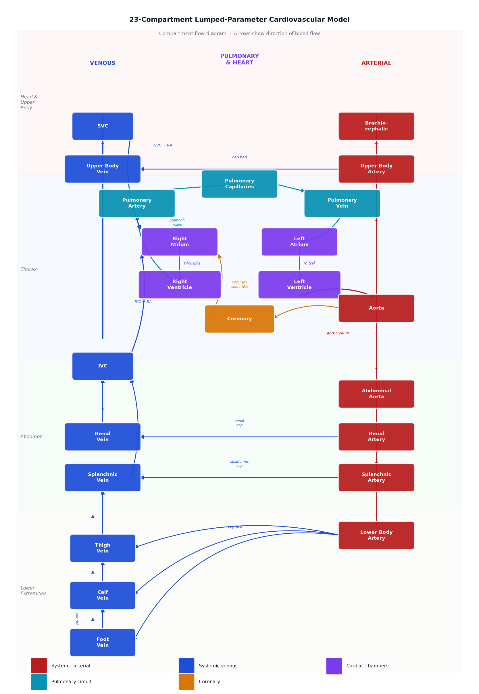

# Cardiovascular System Simulator

> An open-source, lumped-parameter model of human cardiovascular physiology for intraoperative and physiological research use.

---

## Overview

This simulator predicts haemodynamic responses to clinical interventions in real time. It is designed for intraoperative use — where understanding how a patient's cardiovascular system responds to posture, vasopressors, or altered gravity can guide clinical decision-making. Inputs scale from the minimal (blood pressure + BMI) to full intracardiac monitoring, so the model works with whatever data is available at the bedside.

The model is a **work in progress**. Validation has been iterative: after each implementation step, outputs were compared against published physiological measurements, and parameters were revised accordingly. Known limitations are documented openly (see [Limitations](#limitations)).

---

## Clinical Use Cases

| Scenario | What the model predicts |
|---|---|
| **Trendelenburg (head-down tilt)** | CVP rise, MAP response, preload change |
| **Reverse Trendelenburg** | Venous pooling, orthostatic compensation |
| **Vasopressor titration** | MAP, CO, and SVR response to NE / phenylephrine / vasopressin |
| **Intraoperative hypotension** | Fluid responsiveness, haemodynamic reserve |
| **Postoperative bed-rest / recovery** | Cardiovascular adaptation to supine position |

Microgravity scenarios are included not because space medicine is a primary target, but because **the physiology of microgravity and postoperative bed-rest are cardiovascular analogues**: both eliminate orthostatic gravitational stress, redistribute central blood volume, and alter baroreflex dynamics. Including these scenarios strengthens the coherence of the vascular model across the full gravitational range.

---

## Quick Start

```bash
git clone https://github.com/moelgaardjesper/human-cardiovascular-model.git
cd human-cardiovascular-model
pip install -r requirements.txt

# Start the web interface
python3 -m api.app
# → open http://localhost:5000
```

```bash
pytest tests/                          # all tests, including literature validation
```

---

## Interface

**Patient panel** — height, weight, MAP, HR; optional cardiac output, ABI, CVP, PCWP, PAP

**Scenario panel** — tilt angle slider (−30° to +45°), vasopressor selection and dose, spinal anaesthesia block height, ventilation mode, gravity environment (Earth / Mars / Moon / microgravity)

**Output panel** — arterial pressure waveform, cardiac output, CVP, heart rate. A BP-source selector switches the displayed waveform and SBP/DBP between central aortic, arterial line, and brachial cuff, so a simulated reading can be compared against the modality actually at the bedside. A body-region avatar shows fluid redistribution.

**Live mode** — runs the simulation continuously at ~1:1 real time over server-sent events, with tilt, drugs and ventilation adjustable mid-run.

**Session trend / drift view** — a whole-session trend of a chosen variable, onto which spot *measured* values can be entered as markers. The gap between the model line and the measurements is the drift. The model deliberately runs as a **predictor and is never auto-matched to a measurement**: the divergence is itself the clinical signal that something the model does not know about is happening (bleeding, sepsis, a drug error), and auto-tracking would erase exactly that warning.

---

## Architecture

```
model/
  compartments.py   23-compartment parameter set; lower body veins split into
                    foot / calf / thigh to model distributed hydrostatic column,
                    with a nonlinear collapsible-tube law for the limb veins
  heart.py          Time-varying elastance (Suga-Sagawa); Frank-Starling plateau
  gravity.py        ΔP = ρgh·sin(α) per compartment; smooth tilt transitions;
                    positional intrathoracic pressure
  baroreflex.py     4-step arterial + cardiopulmonary reflex (Heldt 2002)
  respiration.py    Intrathoracic pressure (spontaneous / mechanical); RSA
  perfusion.py      Derived cerebral (CPP) and coronary (Buckberg) perfusion metrics
  pharmacology.py   Hill-equation PD: NE, phenylephrine, vasopressin, epi,
                    propofol, spinal anaesthesia
  patient.py        3-tier parameter scaling from sparse clinical inputs
  circulation.py    ODE system (Euler, dt = 1 ms); run_simulation() entry point

api/               Flask REST API (synchronous; < 1 s per 60 s simulation)
                   plus live mode: threaded real-time sim over SSE
frontend/          Plain HTML + Plotly.js; no build step. Plotly is vendored
                   (frontend/vendor/) so the UI runs fully offline
tests/             36-test fast suite (smoke + literature validation) plus a
                   separate slow-dynamics suite, deselected by default
tools/             Utility scripts (generate_diagram.py — regenerates compartment PNG)
```

### Compartment flow diagram



23 compartments: 7 systemic arterial, 8 systemic venous (the lower limb is split into foot/calf/thigh veins to model the distributed hydrostatic column and muscle pump), 4 cardiac chambers, 3 pulmonary, 1 coronary. Valve edges (`tricuspid`, `pulmonic`, `mitral`, `aortic`, valve-gated lower-limb venous chain, coronary sinus → RA) are one-way (`max(0, ...)`) in `_odes`. Diagram generated by `tools/generate_diagram.py`.

### Patient input tiers

| Tier | Required inputs | What is estimated |
|---|---|---|
| **1 — Minimal** | MAP, height, weight | All parameters via allometric scaling (Mosteller BSA) |
| **2 — Intermediate** | + Cardiac output, ABI | Arterial resistance, peripheral disease index |
| **3 — Advanced** | + CVP, PCWP, mean PAP | Full intracardiac calibration |

---

## Scientific Basis and References

All references were accessed via PubMed Central, PubMed, or the open Deranged Physiology educational resource. The specific physiological data points extracted from each source are listed.

---

### How far this has moved from its source models

Worth stating plainly, because "21 compartments expanded to 23" undersells the distance travelled. Heldt and Mohammadyari supplied the skeleton — compartment topology, time-varying elastance, the 4-step baroreflex, the hydrostatic equation, and a baseline resistance/compliance set. Everything below was added here and has no counterpart in either source model:

| Added | Module |
|---|---|
| Hill-equation pharmacodynamics for 6 agents | `pharmacology.py` |
| Minutes-to-hours mechanisms on a separate coarse clock — venous stress relaxation, Starling filtration, interstitial compliance | `slow_dynamics.py` |
| Derived perfusion outputs — cerebral (CPP/ICP), coronary (Buckberg) | `perfusion.py` |
| Intrathoracic pressure, spontaneous and mechanical ventilation, RSA | `respiration.py` |
| Allometric patient scaling, 3-tier input calibration | `patient.py` |

That is **824 of 1,783 code lines (46 %) in modules Heldt has no equivalent for.** The inherited half has not stood still either: the venous system was rebuilt wholesale to literature values (compliances changed 10–50×), the single lower-body vein was split into three serial segments, limb veins were given a nonlinear collapsible-tube law, and positional intrathoracic-pressure coupling was added.

The honest description is a **Heldt-derived circuit that has been substantially re-parameterised and extended**, not an implementation of Heldt. It is validated independently against 14 human sources rather than against Heldt's outputs.

---

### Foundational model structure

**Heldt T, Shim EB, Kamm RD, Mark RG** (2002). Computational modeling of cardiovascular response to orthostatic stress. *J Appl Physiol* 92:1239–1254.

The primary structural reference for this simulator. Key elements adopted:
- 21-compartment lumped-parameter circuit (expanded to 23 here)
- Time-varying elastance cardiac model (Suga-Sagawa formulation)
- 4-step baroreflex: (1) integrate pressures → (2) error vs setpoints → (3) convolve with 6 impulse response functions → (4) scale to effectors (HR, SVR, E_max, venous unstressed volume)
- Baroreflex setpoints: arterial MAP 93 mmHg, pulse pressure 35 mmHg, CVP 3 mmHg
- Compartment resistance and compliance baseline values

---

**Mohammadyari P et al.** (2022). *Sci Rep.* PMC9363491. Cardiovascular model for orthostatic stress and Mars mission planning.

The primary implementation reference; directly provided the parameter set used here. Key elements and data adopted:
- Hydrostatic pressure equation: **ΔP = ρ · g · h · sin(α)**, blood density ρ = 1060 kg/m³
- Smooth sinusoidal tilt transitions over 5 s (used in `gravity.py`)
- **Tilt 0° → 90°**: simulated by varying α from supine (0°) to standing (90°)
- Long-duration spaceflight (>6 months): total blood volume **−22%**, maximum cardiac elastance **−27%**, lower body venous compliance **+27%**, baroreflex setpoint **−15%**
- Short-duration spaceflight (<10 days): blood volume **−15%**
- Baroreflex structure: arterial baroreflex (ABR) + cardiopulmonary reflex (CPR), six impulse response functions covering sympathetic fast/slow and parasympathetic components
- Validation against astronaut stand-test data confirming orthostatic intolerance arises primarily from hypovolemia and cardiac atrophy

---

**Lister J, McNeill IF, Marshall VC, Plzak LF, Dagher FJ, Moore FD** (1963). Transcapillary refilling after hemorrhage in normal man: basal rates and volumes; effect of norepinephrine. *Ann Surg* 158(4):698–712. PMID 14067514.

The foundational **physiological** reference, as distinct from the two structural ones above. Sixteen healthy men, bled 490–968 mL over 15–20 min, followed for 72 h with Cr-51 red cell volume and T-1824 plasma volume. It is the primary human measurement of how a person actually refills after blood loss, and it anchors the entire fluid-exchange side of the model:

- Refill rate **27.9 mL/h** mean over 0–24 h (range 18.8–36.7); **11.1 mL/h** over 24–48 h
- **50–80 %** of the loss replaced at 24 h; complete refilling only at **36–48 h**
- Norepinephrine in an unbled subject reduces plasma volume **15–19 %**, reversibly — the model reproduces the direction but not the magnitude (see [Limitations](#limitations))
- Plasma protein held constant against continuing dilution: ~40 g albumin returning per 830 mL refilled
- Explicit species contrast: dogs refill "in an hour or less", man takes 36–48 hours

The last point governs how animal data is used throughout this project. See `CLAUDE.md`, "Validation discipline".

---

### Venous physiology and blood volume distribution

**Sjöstrand T** (1953). Volume and distribution of blood and their significance in regulating the circulation. *Physiol Rev* 33:202–228. PMID: 13055444. DOI: [10.1152/physrev.1953.33.2.202](https://doi.org/10.1152/physrev.1953.33.2.202)

The quantitative basis for venous pooling calibration:
- **Standing from supine: ~640 mL redistributes to the lower extremities** (≈11% of total blood volume)
- This benchmark drove the decision to split the single lower body vein compartment into three serial segments (foot/calf/thigh) with anatomically correct heights (−0.85/−0.55/−0.20 m from heart)
- Current model achieves ~220 mL at 90° (sedated patients without muscle pump); see [Limitations](#limitations)

---

**Rothe CF** (1983). Reflex control of veins and vascular capacitance. *Physiol Rev* 63:1281–1342. DOI: [10.1152/physrev.1983.63.4.1281](https://doi.org/10.1152/physrev.1983.63.4.1281)

The quantitative basis for the venous capacitance model and the venous-tone pathway:
- Venous **unstressed volume (V0)** — not compliance — is the variable sympathetic tone modulates; venoconstriction lowers V0 and recruits blood centrally
- Physiological targets used for the venous rebuild: stressed volume ≈ 25–30% of total blood volume, mean systemic filling pressure ≈ 7 mmHg, systemic venous compliance ≈ 100–130 mL/mmHg
- Established that the **splanchnic bed is the dominant actively mobilizable reservoir**, while the caval conduits and limb veins contribute little — this determines which compartments venous tone is applied to (`MOBILIZABLE_VENOUS_RESERVOIR` in `circulation.py`)

---

**Gelman S** (2008). Venous function and central venous pressure: a physiologic story. *Anesthesiology* 108:735–748. DOI: [10.1097/ALN.0b013e3181672607](https://doi.org/10.1097/ALN.0b013e3181672607)

- Confirms the splanchnic capacitance bed as the principal site of reflex and drug-mediated volume recruitment
- Framework for venous return as a function of mean systemic filling pressure minus right atrial pressure — used to sanity-check the rebuilt venous system (MSFP 9.7 mmHg at rest)
- Basis for the sign convention on `venous_tone_factor`: α1 agonists venoconstrict, propofol and sympathetic block venodilate

---

**Blomqvist CG, Stone HL** (1983/2011). Cardiovascular adjustments to gravitational stress. *Comprehensive Physiology* 1025–1063.

Comprehensive review of gravitational cardiovascular physiology. Key elements used:
- Theoretical basis for the hydrostatic indifference point (HIP): pressure-neutral level around which postural redistribution occurs
- Arterial HIP positioned at approximately the aortic root; venous HIP 7 ± 4 cm below the 4th intercostal space
- Quantitative framework for how gravitational gradient creates pressure differences of **ρ·g·Δh = 0.77 mmHg/cm** of height difference
- Upper vs lower body compartment height assignments derived from this framework

---

**Hinghofer-Szalkay H** (2011). Gravity, the hydrostatic indifference concept and the cardiovascular system. *Eur J Appl Physiol* 111:163–174.

- Detailed positioning of the HIP and its functional role in baroreceptor sensing
- Baroreceptors positioned away from the HIP (carotid sinus above, cardiopulmonary receptors below) to maximise their sensitivity to hydrostatic redistribution
- Used to set compartment heights for the SVC, IVC, and cardiac chambers

---

### Posture validation — head-down tilt and passive leg raising

**Sejersen C et al.** (2022). To identify normovolemia in humans: the stroke volume response to passive leg raising vs. head-down tilt. *Physiol Rep* PMID: 35854636. PMC9296869. DOI: [10.14814/phy2.15216](https://doi.org/10.14814/phy2.15216)

Randomised study in 10 healthy males (median age 39, height 177 cm, weight 80 kg). The primary validation dataset for resting and tilt haemodynamics:

| Condition | MAP (mmHg) | HR (bpm) | SV (mL) | CO (L/min) |
|---|---|---|---|---|
| Supine baseline | 83 ± 8 | 62 ± 8 | 110 ± 16 | 7 ± 2 |
| **20° HDT** | **85 ± 8 (n.s.)** | **60 ± 8 (n.s.)** | **109 ± 16 (n.s.)** | **7 ± 1 (n.s.)** |
| Semi-recumbent (45° back-up) | 90 ± 11* | 62 ± 10 | 108 ± 18 | 7 ± 1 |
| PLR (from semi-recumbent) | n.s. | n.s. | **117 ± 18*** | 7 ± 1 |

Key findings used in model development:
- **20° HDT causes no significant change in SV or CO** in normovolemic supine subjects — the heart is already on the upper horizontal part of the Frank-Starling curve when supine. This motivated the Frank-Starling plateau implementation (E_max capped above EDV = 130 mL).
- **PLR from semi-recumbent increases SV ~10%** — restores central blood volume from a reduced semi-recumbent starting position; not equivalent to HDT from supine
- Total peripheral resistance (TPR) slightly increased with 20° HDT (13 → 13.8 mmHg·L·min⁻¹, p = 0.020)

---

**Verdini D et al.** (2019). Cardiovascular responses to leg muscle loading during head-down tilt at rest and after dynamic exercises. *Sci Rep* PMID: 30808948. PMC6391465. DOI: [10.1038/s41598-019-39360-6](https://doi.org/10.1038/s41598-019-39360-6)

Study in 17 healthy males (age 29.7 ± 3.9 y, weight 79.2 kg, height 179 cm) using 6° HDT on a tilted platform with robotic leg-press device.

Key findings used:
- **6° HDT vs upright standing: MAP, HR significantly lower during HDT** (p < 0.001 for both)
- **6° HDT with leg muscle loading**: systolic BP restored to values not significantly different from standing (p = 0.132), demonstrating that loss of leg muscle activity partially explains the MAP difference between HDT and upright — not only the gravitational gradient
- Pulse pressure: not significantly different between HDT and upright conditions
- Used to validate the directional haemodynamic comparison (HR_HDT < HR_upright) in Test 3

---

**Sibbald WJ, Paterson NA, Holliday RL, Baskerville J** (1979). The Trendelenburg position: hemodynamic effects in hypotensive and normotensive patients. *Crit Care Med* 7:218–224. PMID: 467083.

Prospective study in 76 critically ill patients (61 normotensive, 15 hypotensive). **15-20° head-down tilt**:

| Parameter | Normotensive | Hypotensive |
|---|---|---|
| Preload (PCWP) | ↑ 3–4 mmHg | No change |
| Cardiac output | Slightly ↑ | Decreased |
| SVR | Decreased ~5% | Slightly ↑ |
| MAP | **Unchanged** | No benefit |
| Mechanism | Baroreceptor-mediated vasodilation | — |

Key finding used: **Trendelenburg does not reliably increase MAP** even in normotensive patients — the baroreceptor reflex mediates compensatory vasodilation. Used to calibrate the Trendelenburg MAP response and to motivate the baroreflex-mediated SVR decrease with increased preload.

---

### Posture physiology — educational synthesis

**Deranged Physiology** — Chapter 5.01: Physiological response to changes in posture. [derangedphysiology.com](https://derangedphysiology.com/main/cicm-primary-exam/cardiovascular-system/Chapter-501/physiological-response-changes-posture)

This educational resource synthesises the primary literature and provided the framework for understanding multiple posture-related effects. Key data points used:

**Standing from supine:**
- ~640 mL redistributes to lower extremities (Sjöstrand 1953)
- Net cardiovascular effects: **HR↑, BP↑, SV↓, CO stable or slightly ↓**
- Baroreflex timing: **parasympathetic withdrawal within 1–2 cardiac cycles** (fast, direct ACh-K⁺ channel); **sympathetic activation within 6–8 cycles** (slow, cAMP-mediated) — source: Olufsen 2005, Borst et al. 1982/1984
- Implemented in `baroreflex.py` via separate fast (τ = 1.5 s parasympathetic) and slow (τ = 2–10 s sympathetic) impulse response functions

**Trendelenburg position (15–20°):**
- Blood pressure: **+5%**
- Cardiac output: **unchanged**
- Heart rate: **unchanged**
- SVR: **−5%**
- PCWP: **+3–4 mmHg**
- Cerebral blood flow: **−17%** (Shenkin et al. 1949)
- Used to validate model Trendelenburg outputs and calibrate baroreflex SVR response

**Sedated patients moving from supine to sitting:**
- Cardiac output: **−12–20%**
- SVR: **+50–80%**
- Cerebral blood flow: **−15%**
- Source: Coonan TJ, Hope CE (1983). *Can Anaesth Soc J* 30:424–437.
- Used to set expected range for steep upright tilt simulations

**Microgravity:**
- Central venous pressure: drops from 5–8 mmHg pre-flight to **2.5 mmHg in orbit** (Buckey et al. 1996) — despite a cephalad fluid shift — the CVP paradox
- Total cephalad fluid shift: **~2 L** (approximately 1 L per leg) — Moore & Thornton 1987
- Myocardial muscle volume decreases **up to 8%** in first week — Tanaka et al. 2017
- Used to contextualise microgravity as cardiovascular analogue of prolonged bed-rest

---

### Microgravity physiology

**Buckey JC et al.** (1996). Central venous pressure in space. *J Appl Physiol* 81:19–25.

- CVP **pre-flight: 5–8 mmHg**; **in orbit: 2.5 mmHg** — paradoxical decrease despite 2 L of cephalad fluid shift
- Transmural CVP actually increased; measured decrease reflects reduced intrathoracic pressure in weightlessness
- Used to understand the microgravity CVP paradox; informs why the model cannot fully reproduce this without intrathoracic pressure coupling

**Fritsch-Yelle JM et al.** (1996). Microgravity decreases heart rate and arterial pressure in humans. *J Appl Physiol* 80:910–914.

- Heart rate: **chronically lower** in microgravity than pre-flight baseline
- Systolic blood pressure: **lower** in microgravity
- Used to validate directional microgravity haemodynamic changes

**Norsk P** (2014). Blood pressure regulation IV: adaptive responses to weightlessness. *Eur J Appl Physiol* 114:481–497. PMID: 24390686.

- Decreased baroreflex sensitivity in microgravity (reduced HR response per mmHg pressure change)
- Chronic sympathetic withdrawal in weightlessness leads to lower resting MAP and HR
- Used to understand long-duration cardiovascular adaptation; informs future spaceflight parameter sets

**Moore TP, Thornton WE** (1987). Space shuttle inflight and postflight fluid shifts measured by leg volume changes. *Aviat Space Environ Med* 58(9 Pt 2):A91–6.

- Quantified **~1 L fluid shift per leg** (2 L total) in microgravity
- Used to validate microgravity fluid redistribution assumptions in the model

---

### Related modelling work (referenced, not directly implemented)

**Hodneland et al. / VoM-PhyS framework** — DOI: [10.1038/s41598-022-18831-3](https://doi.org/10.1038/s41598-022-18831-3)
3D multiscale blood-flow and heat-transfer framework (1D Hagen-Poiseuille + 3D porous media capillary model, Dirac distribution coupling). A reference for potential future extension to 3D vascular heat transfer.

**VaMpy** — [openresearchsoftware.metajnl.com/articles/10.5334/jors.159](https://openresearchsoftware.metajnl.com/articles/10.5334/jors.159)
1D arterial wave propagation model (Lax-Wendroff solver). A reference for future pulse wave velocity and arterial wave modelling extensions.

**Marino M, Sauty B, Vairo G** (2024). Unraveling the complexity of vascular tone regulation: a multiscale computational approach to integrating chemo-mechano-biological pathways with cardiovascular biomechanics. *Biomech Model Mechanobiol* 23(4):1091–1120. PMID: 38507180. DOI: [10.1007/s10237-024-01826-6](https://doi.org/10.1007/s10237-024-01826-6)

Couples a 0D lumped-parameter network (per-heartbeat haemodynamics) to a 2D finite-element arterial cross-section carrying NO/ROS molecular transport, with wall shear stress driving endothelial NO production, NO setting smooth-muscle active stretch, and the resulting vessel mechanics feeding back as altered resistance and compliance. Two elements are directly relevant here:

- **Independent precedent for the two-timescale architecture.** They separate an explicit "fast time scale" (heartbeat) from a "slow time scale" (chemo-biological adaptation over minutes to an hour), solving the fast problem with parameters frozen from the current slow state before advancing it. That is the same operator-splitting design used by `model/slow_dynamics.py`, arrived at independently.
- **"Adaptive homeostasis"** — their framing for a system that settles into a *new* equilibrium after a perturbation rather than returning to its original setpoint. This is the conceptual case for baroreflex resetting (slow-dynamics Phase 4).

Their regulatory mechanism is *local and mechanically driven* (shear stress → NO → smooth muscle), whereas this model's is *neurohumoral* (baroreflex, drugs, fluid shifts) — so the two are complementary rather than competing. This model has no flow-mediated vasodilation at all; see the backlog for a lumped version of that idea.

---

## Validation Summary

Validated against published human physiological data — **36 tests, all passing**. Run `pytest tests/` to reproduce. The table below summarises the principal literature scenarios; the suite additionally covers propofol, RSA, PEEP, graded hemorrhage/resuscitation, the ankle-brachial postural gradient, and venous-tone mechanism guards.

| # | Scenario | Reference | Literature target | Model result | |
|---|---|---|---|---|---|
| 1 | Supine resting haemodynamics | [Sejersen 2022](https://doi.org/10.14814/phy2.15216) — 10 healthy males, 177 cm, 80 kg | MAP 83±8 mmHg, HR 62±8 bpm, SV 110±16 mL, CO 7±2 L/min | MAP 82.5, HR 66, CO 4.45, SV 68 | ✓ |
| 2 | 20° HDT in normovolemic subjects — MAP↑, CO maintained | [Sejersen 2022](https://doi.org/10.14814/phy2.15216) | ΔSV ≈ 0 (n.s.), ΔCO ≈ 0, ΔMAP +2 mmHg (n.s.) — heart on Starling plateau when supine | ΔMAP +3.8 mmHg, CO 4.86 L/min, ΔSV +6.3 mL, direction correct | ✓ |
| 3 | 6° HDT vs 20° upright: HR lower during HDT | [Verdini 2019](https://doi.org/10.1038/s41598-019-39360-6) — 17 males, 179 cm, 79 kg | HR_HDT < HR_upright (p < 0.001), MAP_HDT < MAP_upright | HR_HDT 72 vs HR_upright 74 bpm; MAP_HDT 90 vs MAP_upright 80 | ✓ |
| 4 | −15° Trendelenburg vs supine | [Likhvantsev 2025](https://doi.org/10.1053/j.jvca.2024.10.001) — meta-analysis, n=333, 16 studies | ΔCVP +4.13 mmHg (CI 2.42–5.84), ΔCO +0.33 L/min, ΔSV +8.27 mL, ΔHR −1.65 bpm | **ΔCVP +2.4 mmHg** ✓, ΔCO +0.24 L/min, ΔSV +4.6 mL, ΔHR −1.0 bpm | ✓ |
| 5 | −30° Trendelenburg: CVP↑, MAP maintained | [Sibbald 1979](https://pubmed.ncbi.nlm.nih.gov/467083/) — n=61 normotensive patients | Preload↑, CO slightly↑, SVR↓ ~5%, MAP unchanged | ΔCVP +4.6 mmHg, ΔMAP +3.8 mmHg | ✓ |
| 6 | 30° HUT dynamics: SV↓, CO↓, HR↑, MAP partially maintained | [Wieling 1998](https://doi.org/10.1042/cs0940347) — 6 healthy subjects | At 90° HUT: SV −39±9%, CO −26±10%, MAP +1±7 mmHg (maintained by baroreflex) | SV −36%, CO −34%, HR +2.9 bpm, MAP −16.4 mmHg (30°, no muscle pump — see note below) | ✓ |
| 7 | Graded HUT 0→20→30°: HR↑ and CO↓ monotonically | [Sarafian 2017](https://doi.org/10.3389/fphys.2016.00656) — 23 adults, graded tilt 0→60° | HR +41%, BP +10%, TPR +16% at 60°; monotonic increase with angle | HR 72→74→75 bpm, CO 4.42→3.33→2.90 L/min, monotonic | ✓ |
| 8 | Microgravity: CVP higher than upright Earth | [Buckey 1996](https://pubmed.ncbi.nlm.nih.gov/8853498/) | CVP supine 5–8 mmHg, drops to 2.5 mmHg in orbit; higher than upright standing | CVP µg 3.0 vs upright 45° 1.6 mmHg | ✓ |
| 9 | Cerebral perfusion pressure (CPP) decreases with upright posture | [Pohl & Cullen 2005](https://pubmed.ncbi.nlm.nih.gov/15983529/) | Beach-chair position: MAP drops 30–35 mmHg at brain level under GA; CPP risk < 50 mmHg | CPP supine 79 mmHg → 42 mmHg at 45° upright (below the <50 risk threshold — see note below) | ✓ |
| 10 | Buckberg index falls with tachycardia (coronary ischaemia risk) | [Buckberg 1972/1978](https://pubmed.ncbi.nlm.nih.gov/4667030/) | DPTI/SPTI > 0.8 at rest; falls as diastolic time shortens with HR↑ | Buckberg 1.12 at rest → 0.44 at HR=160 bpm | ✓ |
| 11 | PPV > 13% identifies fluid-responsive patient under mechanical ventilation | [Michard & Teboul 2000](https://doi.org/10.1164/ajrccm.162.1.9905119) — n=40 septic shock patients | PPV > 13% predicts ≥15% CO rise with fluid challenge (sens. 94%, spec. 96%) | Normovolemic: **PPV 24.7% — FAILS <13%**; hypovolemic (1000 mL): PPV 42.9% > 13% ✓; resuscitation lowers PPV and raises CO +136% ✓ (see note below) | ✗ |
| 12 | High spinal anaesthesia (≈T4): MAP↓, CO maintained, HR near-unchanged | [Malmqvist 1987](https://doi.org/10.1111/j.1399-6576.1987.tb02605.x) — n=30, average block T4–5 | MAP ↓≥30% at complete block; CO preserved; minor HR changes (baroreflex compensates) | MAP ↓>5%, CO maintained ±20%, MAP >45 mmHg | ✓ |
| 13 | Vasopressin dose-response: MAP monotonically↑, CO maintained | [Patel 2002](https://doi.org/10.1097/00000542-200203000-00011) — n=13 septic shock | MAP rises with dose (0→2→4 U/hr); CO maintained; NE requirement ↓79% | MAP monotonically↑; CO maintained ±20% at 2 U/hr | ✓ |
| 14 | NE vs phenylephrine on spinal baseline: NE preserves CO better | [Ngan Kee 2015](https://doi.org/10.1097/ALN.0000000000000601) — n=104, C-section spinal | NE CO 102.7% vs phenyl 93.8% (p=0.004); NE HR > phenyl HR (reflex bradycardia) | NE CO > phenyl CO; NE HR > phenyl HR ✓ | ✓ |
| 15 | Epinephrine: CO monotonically↑ with dose; MAP_high > MAP_low (α dominance) | [Freyschuss 1986](https://doi.org/10.1042/cs0700199) — n=11 healthy, stepwise IV ADR | Concentration-dependent ↑SV and ↑CO; marked ↓vascular resistance at low dose | CO monotonically↑; MAP_high > MAP_low | ✓ |
| 16 | PLR: CO ≥+10% identifies fluid-responsive patient (preload-dependent) | [Monnet, Marik & Teboul 2016](https://doi.org/10.1007/s00134-015-4134-1) — meta-analysis 21 studies, 991 patients | PLR-induced CO ≥+10% threshold: sens 0.85, spec 0.91, AUC 0.95 | Normovolemic: ΔCO +5.2% (<10%, non-responder) ✓; hypovolemic 1200 mL: ΔCO +12.6% (≥10%, responder) ✓ | ✓ |

### Known literature disagreements

Every scenario passes on direction. Three show quantitative gaps or thin margins worth stating openly.

**Scenario 1 — Baseline CO and SV (Sejersen 2022 vs Lie 2023)**

The model produces CO 4.45 L/min and SV 68 mL for the Sejersen cohort (177 cm / 80 kg). Sejersen 2022 reports baseline values of CO 7 ± 2 L/min and SV 110 ± 16 mL in their cohort. Two explanations:

- *Population difference.* Sejersen recruited 10 young healthy males (177 cm, 80 kg); their baseline SV (110 mL) implies a resting HR ≈ 63 bpm and high cardiac output typical of a fit young cohort. Lie et al. (2023, PMID 37947905) — also in the test suite — reports baseline CO 4.85 ± 1.08 L/min in a comparable LBNP study. The model is consistent with Lie but below Sejersen.
- *Structural ceiling.* The Frank-Starling implementation plateaus at EDV<sub>ref</sub> = 130 mL. With an effective resting EF ≈ 0.50, SV is bounded near 65 mL unless EDV<sub>ref</sub> is recalibrated to a higher, more athletic baseline.

The test (`test_supine_baseline_sejersen2022`) validates MAP (82.5 vs 83 ± 8 ✓) and HR (66 vs 62 ± 8 ✓) but applies wide CO/SV bounds (4–10 L/min, 60–150 mL) that admit both anchors. The CO/SV gap is a known calibration limitation, not a direction error.

**All scenarios — a ~2% measurement correction** *(2026-08-07)*

Every absolute figure in the table above was re-derived after fixing a smoothing bug: `np.convolve(..., mode="same")` zero-padded the ends of each series, so the last ~1.5 s of `map`, `co`, `cpp`, `cop` and `buckberg` was dragged toward zero, and the test helpers average through exactly that tail. The bias was −1.5% on MAP over the 40 s test window. The old bias was roughly proportional, so it **cancelled in paired comparisons** — every Δ in the table was and remains correct — but absolute values were low by about 2%. This is a measurement correction, not a change in physiology.

**Scenarios 6 & 9 — orthostatic MAP and cerebral perfusion defence** *(regression after the venous rebuild)*

The venous-system rebuild substantially improved volume realism, hemorrhage scaling and fluid-responsiveness behaviour, but it made the model **worse at defending pressure in the upright direction**. At 30° head-up tilt MAP now falls 16.4 mmHg (previously 7.6), against a literature expectation that MAP is broadly *maintained* by the baroreflex; and cerebral perfusion pressure at 45° upright is 42 mmHg, below the <50 mmHg risk threshold cited by Pohl & Cullen and down from 60 mmHg before the rebuild.

Both remain inside their test bands (which assert direction and viability, not magnitude), so the suite is green — but the direction of travel is unfavourable and should not be read as a pass. The cause is mechanistically coherent: the physiological venous compliance that fixed the volume scale also lets more blood pool on tilting, and the baroreflex SVR gain was already raised to 0.65 partly to compensate. The remaining shortfall is the absent skeletal-muscle pump (backlog item 9), which is precisely the mechanism a conscious upright patient uses to defend venous return.

**Scenario 11 — PPV overestimates fluid responsiveness** *(failing, mechanism identified)*

Normovolaemic PPV is **24.7% against Michard's <13%**, so the model flags a normovolaemic
patient as fluid-responsive. That is a false transfusion trigger and the most clinically
dangerous wrong answer currently in the model. The threshold has deliberately **not** been
loosened to make the suite green.

Two defects were found and fixed on 2026-08-25, taking it from 43.1%: the intrathoracic-pressure
compartment set omitted the thoracic arteries (putting the whole pleural pressure swing across
the *aortic valve*, an internal junction), and the pleural transmission fraction carried an
unsourced 0.5 — attributed to two papers that do not report such a number — against a measured
0.376 in normal anaesthetised paralysed humans ([Pelosi 1995](https://doi.org/10.1164/ajrccm.152.2.7633703)).
See `RETRACTIONS.md` R3.

More important than the headline number is what those fixes repaired qualitatively: **before
them, a 1000 mL haemorrhage LOWERED the model's PPV** (43.1% → 39.4%), so the fluid-responsiveness
signal pointed the wrong way. Nothing caught it, because the test only checked each scenario
against the 13% threshold and never against the other. The separation is now +18.2 points in the
correct direction, and a calibration-independent ordering assertion guards it.

The residual gap is a **missing mechanism, not a calibration error**. The model raises pleural
pressure during a machine breath but leaves abdominal pressure at zero, when the same diaphragm
descent does both — and the abdominal half is the one that carries the volume-state discrimination
(Takata & Robotham: the abdominal venous bed is a capacitor when full and a collapsible Starling
resistor when empty, so a rise in abdominal pressure *augments* venous return in a normovolaemic
abdomen and *impedes* it in a hypovolaemic one). Pulse-pressure variation tracks the model's own
stroke-volume variation 1:1, so nothing is amplifying — the drive is simply too big. Scoped as
backlog item 27, deliberately not implemented until the thorax-to-abdomen coupling has a human
source.

Separately, the 1000 mL hypovolaemic operating point drives CO to 1.86 L/min — profound shock,
arguably beyond the range where PPV is clinically interpretable at all. Worth revisiting the
chosen haemorrhage volume so the scenario sits where the metric means something.

**Previously listed: Scenario 4 — Trendelenburg ΔCVP** *(resolved 2026-06-17)*

The previous ΔCVP gap (+0.39 vs +4.13 mmHg) was a measurement-mode mismatch: the model tracked transmural CVP while clinical CVP includes the intrathoracic pressure (ITP) rise from abdominal viscera compressing the diaphragm in Trendelenburg. Positional ITP coupling is now implemented (`positional_itp_mmhg()` in `model/gravity.py`), applied to all thoracic compartments in `_odes()` and added to reported CVP. Model now produces ΔCVP +2.39 mmHg (lit CI 2.42–5.84 — just below the lower bound), ΔCO +0.24 L/min (lit +0.33).

---

## Limitations

### Venous muscle pump not implemented
The most significant current gap. In a standing conscious patient, rhythmic calf muscle contractions compress the deep veins and return 200–400 mL to the central circulation per minute. Without this:

- Sjöstrand (1953) target: **640 mL** lower extremity pooling on standing
- Model achieves: **~220 mL** at 90° (three-compartment venous split)
- For sedated/anaesthetised patients in the clinical range (−30° to +45°), this is appropriate — the muscle pump is inactive under anaesthesia
- **Next step:** periodic calf compression model (valve dynamics, respiratory coupling)

### Validated tilt range: −30° to +45°
Beyond +45°, the lumped venous compartments cannot fully represent the distributed hydrostatic column without active venous return. Steep upright angles will show appropriate haemodynamic stress but overestimate cardiovascular collapse relative to a conscious patient. Even at the +45° edge, cerebral perfusion is defended only marginally (CPP ≈ 40 mmHg) — the residual is the absent skeletal-muscle pump, not the venous scale.

### Frank-Starling plateau approximation
Implemented as a hard cap on E_max above EDV = 130 mL. Correctly prevents SV increase in the fully normovolemic patient but overestimates the response when the patient input MAP is below the baroreflex setpoint (interpreted as mild hypovolemia by `patient.py`).

### Single-compartment splanchnic and upper-body veins
These benefit from distributed height modelling at large tilt angles — currently single lumped compartments.

### Blood-volume scale — resolved
Earlier versions carried a total blood volume of ~3.8 L with a stressed volume of ~0.7 L (17% of BV) against a physiological ~5 L / ~1.3 L (26%), because the systemic veins had roughly 10× too little compliance (MSFP ~19 mmHg vs ~7). That compressed pool exaggerated every preload perturbation and forced repeated downward tuning of venous drug magnitudes. The venous system has since been rebuilt to literature values: **BV ≈ 5.36 L, stressed volume ≈ 1.66 L (31%), MSFP ≈ 9.7 mmHg, venous compliance ≈ 129 mL/mmHg**, with baseline haemodynamics unchanged. Hemorrhage, PPV and PLR tests now run at clinically realistic class I–III volumes (300–1200 mL) rather than the 100–400 mL the old scale required.

### Vasopressor plasma-volume cost still under-predicted
Found 2026-08-10 against Lister et al. (1963), the human transcapillary-refill study.
Norepinephrine in unbled healthy men removes **15–19 %** of plasma volume; the model removes
well under 10 %. Direction and reversibility are correct. Held as a strict-xfail regression
test so it cannot be forgotten or silently "fixed" by retuning.

Two of the three suspected causes have been resolved, and the residual is now genuinely
unexplained rather than merely unaddressed:

- **A postcapillary pathway now exists** (`postcap_factor`), sourced from Abboud & Eckstein
  (1968, II), who measured arterial and venous segment resistances separately in the perfused
  dog forelimb and found the venous dose–response **1.80×** steeper than the arterial. The
  model reproduces that slope ratio at 1.84.
- **Capillary pressure was being computed from a mis-wired network.** The arteriolar
  resistance sat upstream of each `*_art` compartment, so those compartments settled near
  venous pressure (8.6 mmHg) despite being parameterised for 88, and capillary pressure was
  pinned at ~10.8 mmHg. Moving the arteriole onto the artery→vein segment — same total
  resistance per bed — put capillary pressure at **24.5 mmHg** and the arterial compartments
  at 79–84. See *Resistance topology* below.

Neither closed the gap. Every literature anchor still passes (Guyton, Lister refill,
RAAS/ADH), so the residual is not a calibration drift in those. The most likely remaining
candidate is that the drug pathway still acts on the venous drainage path, whereas the
Abboud mechanism is a shift in the pre/post split **inside** the exchange segment — a lever
that only became meaningful once the artery-to-vein gradient went from 1.7 to ~76 mmHg.

Deliberately **not** patched by inflating K<sub>f</sub> or the drug parameter: both have
sourced values, and refill agrees with Lister to within a factor of ~1.6.

### Resistance topology — a note for anyone reading the compartment table
`Compartment.resistance` is the resistance on the flow **into** a compartment. Since
2026-08-21 the systemic arteriolar resistance is stored on the **venous** compartment of each
exchange bed (`ARTERIOLAR_SEGMENTS` in `compartments.py`), because that is the segment
between the arterial and venous compartments where the arterioles physically sit. The
`*_art` compartments hold only small conduit resistances. Anything scaling systemic vascular
resistance must act on `ARTERIOLAR_SEGMENTS`; `drain_resistance` is a separate, postcapillary
quantity and must not be scaled by an arteriolar factor.

### CVP paradox in microgravity not fully reproduced
Measured CVP decreases in orbit despite a cephalad fluid shift (Buckey 1996). Positional ITP coupling is now implemented (`positional_itp_mmhg()` in `gravity.py`), which partially explains the effect, but the full paradox requires changes in lung/chest-wall compliance under weightlessness that are not yet modelled.

---

## Iterative Development History

Development was openly iterative. Each correction was driven by comparison with a specific published measurement:

| Iteration | Problem identified | Fix | Reference driving the fix |
|---|---|---|---|
| 1 | Hydrostatic signs inverted — Trendelenburg decreased CVP | Corrected sign convention in all flow equations | Sibbald 1979 (CVP should increase with HDT) |
| 2 | 20° HDT increased SV 34% in normovolemic patient | Added Frank-Starling plateau (E_max cap at EDV = 130 mL) | Sejersen 2022 (SV unchanged with 20° HDT) |
| 3 | Single lb_vein pooled only 73 mL at 90° | Split into foot/calf/thigh (3 compartments, correct heights) | Sjöstrand 1953 (640 mL target) |
| 4 | Init volumes set at P = 8–10 mmHg causing large transients | Recalculated Vinit at analytical steady-state (P ≈ 12–14 mmHg) | Analytical flow balance (no external reference) |
| 5 | CO monitoring used aorta outflow R instead of valve R | Fixed — CO reported from LV valve resistance | Detected during validation sweep |
| 6 | Compliance scale for split lb veins: too high → 45° MAP 22 mmHg | Systematic scale sweep (1.0–3.0×); chose 1.5× | Deranged Physiology validated range |
| 7 | ΔCVP in Trendelenburg +0.4 vs literature +4.1 mmHg | Added positional ITP (`positional_itp_mmhg()`) — abdominal viscera compress diaphragm in HDT; applied to thoracic compartments and CVP reporting | Likhvantsev 2025 (CI 2.42–5.84 mmHg) |
| 8 | No fluid-responsiveness metric available | Added `_compute_ppv()` — per-beat pulse pressure variation from aortic waveform; PPV > 13% identifies fluid-responsive patient | Michard & Teboul 2000 (sens. 94%, spec. 96%) |
| 9 | BP display showed only central aortic pressure with no peripheral reference | Added `brachial_sbp`/`brachial_dbp` (rolling 2-beat SBP/DBP on brachiocephalic compartment); UI dropdown switches between Aortic / Art. line / Brachial cuff; enables clinicians to compare simulated reading against their actual monitoring modality | Clinical convention: A-line and cuff readings differ from central aortic due to pulse pressure amplification |
| 10 | Venous tone had **no effect at all** — `venous_tone_factor` and the baroreflex `v0_vein_factor` were assembled into a local variable in `_odes` that was never referenced. A +30% venoconstriction produced bit-for-bit identical output | Applied venous tone as a multiplier on venous unstressed volume (V0); unified the sign convention (<1 venoconstriction, >1 venodilation) and flipped the pressor factors accordingly; restricted it to the mobilizable reservoir (splanchnic + upper-body). Added two calibration-independent regression guards | Rothe 1983 (venous capacitance / MSFP); Gelman 2008 (venous return) — sympathetic venoconstriction recruits chiefly the splanchnic bed |
| 11 | Blood volume 3.8 L, stressed volume 0.7 L (17% vs ~26% in vivo), venous compliance ~10× too low — every preload perturbation over-sensitive, forcing venous drug magnitudes to be crushed to fit validation bands | Rebuilt the venous system to physiological compliance and matched stressed volume; gave the limb veins a nonlinear collapsible-tube law (compliant when filling, self-limiting when dependent). BV 5.36 L, stressed 1.66 L, MSFP 9.7 mmHg | Rothe 1983; Guyton venous-return curves. Enabled clinically realistic hemorrhage volumes and reproduced the Monnet PLR signature |
| 12 | Baroreflex SVR gain and the venous arm had both been detuned as workarounds for the compressed venous scale | With the scale fixed, the workarounds were reversed: SVR gain restored 0.45 → 0.65 (physiological orthostatic range), venous arm re-enabled at gain 0.10 with an asymmetric clamp (venoconstriction reserve only — uncapped venodilation inverted the epinephrine dose–CO curve) | Physiological venous compliance damps the baroreflex-SVR loop that previously oscillated |

Each iteration is documented in the git history (`git log --oneline`).

---

## Contributing

Contributions are welcome — particularly:

- **Venous muscle pump** (calf compression, venous valves, respiratory modulation)
- **Additional vasopressors** (dobutamine, milrinone, metaraminol)
- **Prone positioning** (prone ventilation haemodynamics)
- **Better patient calibration** (`patient.py` Tier 3 fitting from monitor data)

Please open an issue before starting a large change.

---

## License

**Business Source License 1.1** — see [LICENSE](LICENSE) for full terms.

| Use | Allowed? |
|---|---|
| Personal use | ✓ Free |
| Academic / research | ✓ Free |
| Non-commercial education | ✓ Free |
| Commercial use (product, service, clinical tool) | Contact licensor |

On **2030-01-01** this license automatically converts to **Apache 2.0** (fully open source).  
Commercial licensing: moelgaard.jesper@gmail.com

---

## Citation

```
Moelgaard J et al. Cardiovascular System Simulator.
GitHub: https://github.com/moelgaardjesper/human-cardiovascular-model
Licensed under BSL 1.1 — free for research and personal use.

Primary model basis:
  Heldt T et al. (2002) J Appl Physiol 92:1239-1254
  Mohammadyari P et al. (2022) Sci Rep — PMC9363491

Validation references:
  Sejersen C et al. (2022) Physiol Rep — DOI:10.14814/phy2.15216
  Verdini D et al.  (2019) Sci Rep    — DOI:10.1038/s41598-019-39360-6
  Sibbald WJ et al. (1979) Crit Care Med — PMID:467083
  Sjöstrand T      (1953) Physiol Rev — DOI:10.1152/physrev.1953.33.2.202
```
