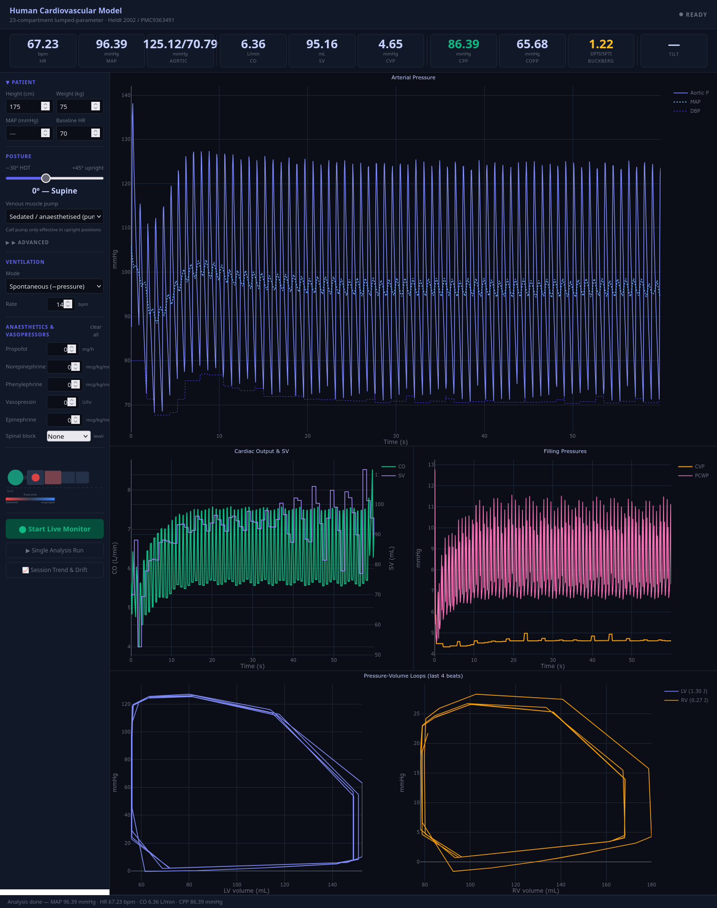

# Cardiovascular System Simulator

> An open-source, lumped-parameter model of human cardiovascular physiology for intraoperative and physiological research use.

---

## Overview

This simulator predicts haemodynamic responses to clinical interventions in real time. It is designed for intraoperative use — where understanding how a patient's cardiovascular system responds to posture, vasopressors, or altered gravity can guide clinical decision-making. Inputs scale from the minimal (blood pressure, height, weight and sex) to full intracardiac monitoring, so the model works with whatever data is available at the bedside.

The model is a **work in progress**. Validation has been iterative: after each implementation step, outputs were compared against published physiological measurements. Known limitations are documented openly (see [Limitations](#limitations)), and the ones still open are carried as strict `xfail` tests so a gap cannot close silently.

One pattern is worth stating up front, because it has shaped how the project works. **Almost every significant error found here has been structural rather than a matter of calibration**, and they have shared a signature: *a plausible pressure produced by an implausible volume or flow, with nothing constraining the quantity underneath.* Mean arterial pressure, cardiac output and central venous pressure looked reasonable throughout a period in which the arteriolar resistance sat on the wrong side of the capillary bed, the aortic valve was functionally stenotic, intrathoracic pressure was applied across that valve, and only 5 % of systemic resistance sat downstream of the mean-filling-pressure point where humans have 15 %. None of it was visible from the outputs a clinician would look at.

The working rule that follows is in `CLAUDE.md`: **align the model with physiology as it actually is, rather than tuning it to make a number come out right** — and expect that getting the physiology right will sometimes make a validation number *worse*, which is information rather than a setback. In practice this means measuring the internal quantity, not the endpoint. Every gap closed here was closed by finding the structural cause; none by fitting a parameter to the target.

---

## Clinical Use Cases

| Scenario | What the model predicts |
|---|---|
| **Trendelenburg (head-down tilt)** | CVP rise, MAP response, preload change |
| **Reverse Trendelenburg** | Venous pooling, orthostatic compensation |
| **Vasopressor titration** | MAP, CO, and SVR response to NE / phenylephrine / vasopressin |
| **Intraoperative hypotension** | Fluid responsiveness, haemodynamic reserve |
| **Postoperative bed-rest / recovery** | Cardiovascular adaptation to supine position |

Microgravity scenarios are included not because space medicine is a primary target, but because **the physiology of microgravity and postoperative bed-rest are cardiovascular analogues**: both eliminate orthostatic gravitational stress, redistribute central blood volume, and alter baroreflex dynamics. Including these scenarios strengthens the coherence of the vascular model across the full gravitational range.

---

## Quick Start

```bash
git clone https://github.com/moelgaardjesper/human-cardiovascular-model.git
cd human-cardiovascular-model
pip install -r requirements.txt

# Start the web interface
python3 -m api.app
# → open http://localhost:5000
```

```bash
pytest tests/                          # all tests, including literature validation
```

---

## Interface



*The one-shot analysis view for the default supine reference patient. Top row: derived vitals. Below: the aortic pressure waveform with MAP and DBP, cardiac output and stroke volume, filling pressures (CVP and PCWP), and left and right ventricular pressure-volume loops over the last four beats with stroke work annotated. The RV/LV stroke work ratio of 0.27/1.30 = 0.21 was not tuned to — see the right-heart note below. The UI runs fully offline; Plotly is vendored.*

**Patient panel** — height, weight, MAP, HR; optional cardiac output, ABI, CVP, PCWP, PAP

**Scenario panel** — tilt angle slider (−30° to +45°), vasopressor selection and dose, spinal anaesthesia block height, ventilation mode, gravity environment (Earth / Mars / Moon / microgravity)

**Output panel** — arterial pressure waveform, cardiac output, CVP, heart rate. A BP-source selector switches the displayed waveform and SBP/DBP between central aortic, arterial line, and brachial cuff, so a simulated reading can be compared against the modality actually at the bedside. A body-region avatar shows fluid redistribution.

**Live mode** — runs the simulation continuously at ~1:1 real time over server-sent events, with tilt, drugs and ventilation adjustable mid-run.

**Session trend / drift view** — a whole-session trend of a chosen variable, onto which spot *measured* values can be entered as markers. The gap between the model line and the measurements is the drift. The model deliberately runs as a **predictor and is never auto-matched to a measurement**: the divergence is itself the clinical signal that something the model does not know about is happening (bleeding, sepsis, a drug error), and auto-tracking would erase exactly that warning.

---

## Architecture

```
model/
  compartments.py   23-compartment parameter set; lower body veins split into
                    foot / calf / thigh to model distributed hydrostatic column,
                    with a nonlinear collapsible-tube law for the limb veins
  heart.py          Time-varying elastance (Suga-Sagawa); Frank-Starling plateau
  gravity.py        ΔP = ρgh·sin(α) per compartment; smooth tilt transitions;
                    positional intrathoracic pressure
  baroreflex.py     4-step arterial + cardiopulmonary reflex; HR arm gains
                    sourced to Fritsch 1989 and LBNP, not to a parameter table
  respiration.py    Intrathoracic pressure (spontaneous / mechanical); RSA
  perfusion.py      Derived cerebral (CPP) and coronary (Buckberg) perfusion metrics
  pharmacology.py   Hill-equation PD: NE, phenylephrine, vasopressin, epi,
                    propofol, spinal anaesthesia
  patient.py        3-tier parameter scaling from sparse clinical inputs
  circulation.py    ODE system (Euler, dt = 1 ms); run_simulation() entry point

api/               Flask REST API (synchronous; < 1 s per 60 s simulation)
                   plus live mode: threaded real-time sim over SSE
frontend/          Plain HTML + Plotly.js; no build step. Plotly is vendored
                   (frontend/vendor/) so the UI runs fully offline
tests/             36-test fast suite (smoke + literature validation) plus a
                   separate slow-dynamics suite, deselected by default
tools/             Utility scripts (generate_diagram.py — regenerates compartment PNG)
```

### Compartment flow diagram


23 compartments: 7 systemic arterial, 8 systemic venous (the lower limb is split into foot/calf/thigh veins to model the distributed hydrostatic column and muscle pump), 4 cardiac chambers, 3 pulmonary, 1 coronary. Valve edges (`tricuspid`, `pulmonic`, `mitral`, `aortic`, valve-gated lower-limb venous chain, coronary sinus → RA) are one-way (`max(0, ...)`) in `_odes`. Diagram generated by `tools/generate_diagram.py`.

### Patient input tiers

| Tier | Required inputs | What is estimated |
|---|---|---|
| **1 — Minimal** | MAP, height, weight | All parameters via allometric scaling (Mosteller BSA) |
| **2 — Intermediate** | + Cardiac output, ABI | Arterial resistance, peripheral disease index |
| **3 — Advanced** | + CVP, PCWP, mean PAP | Full intracardiac calibration |

---

## Scientific Basis and References

References were accessed via PubMed Central, PubMed, or the open Deranged
Physiology educational resource. **The per-source data points are no longer
listed here** — that list ran to ~200 lines, duplicated the project's working
ledger, and went stale. The complete citation record is generated instead: see
*The sources this model rests on* below.

---

### How far this has moved from its source models

Worth stating plainly, because "21 compartments expanded to 23" undersells the distance travelled. Heldt and Mohammadyari supplied the skeleton — compartment topology, time-varying elastance, the 4-step baroreflex, the hydrostatic equation, and a baseline resistance/compliance set. Everything below was added here and has no counterpart in either source model:

| Added | Module |
|---|---|
| Hill-equation pharmacodynamics for 6 agents | `pharmacology.py` |
| Minutes-to-hours mechanisms on a separate coarse clock — venous stress relaxation, Starling filtration, interstitial compliance | `slow_dynamics.py` |
| Derived perfusion outputs — cerebral (CPP/ICP), coronary (Buckberg) | `perfusion.py` |
| Intrathoracic pressure, spontaneous and mechanical ventilation, RSA | `respiration.py` |
| Allometric patient scaling, 3-tier input calibration | `patient.py` |
| **Patient age** — arterial compliance and chamber volumes by decade | `aging.py` |

That is **1,237 of 2,577 code lines (48 %) in modules Heldt has no equivalent for** (re-counted 2026-09-16; the previous figure counted a wider file set). The inherited half has not stood still either: the venous system was rebuilt wholesale to literature values (compliances changed 10–50×), the single lower-body vein was split into three serial segments, limb veins were given a nonlinear collapsible-tube law, and positional intrathoracic-pressure coupling was added.

Beyond the module table, the model has since gained **instrumented protocols rather than just mechanisms** — a Valsalva manoeuvre, an inspiratory hold, and a circulatory arrest that measures mean systemic filling pressure the way a human study does, by stopping the heart and reading the equilibration.

The honest description is a **Heldt-derived circuit that has been substantially re-parameterised and extended**, not an implementation of Heldt. It is validated independently against **62 distinct sources** rather than against Heldt's outputs (counted by `tools/source_index.py`, which derives the list from the identifiers in the suite rather than from a hand-kept tally).

Heldt's *topology* survives all of it. Almost none of his numbers do — and the one place a Heldt value was still carried, `RV_EMAX`, was replaced the moment anyone checked, because a parameter table from another model is not a measurement.

---

### The sources this model rests on

**This is a representative list, not the bibliography.** Five papers are given
here because they are load-bearing — remove any one and a structural commitment
of the model loses its justification. The model cites **62 distinct sources** in
total.

**That full list is generated, never hand-maintained.** `tools/source_index.py`
walks every PMID, PMC and DOI already written into the test docstrings and
section headers, attributes each to the tests that assert it, and reports whether
those pass or are strict xfails. It ships in the freeze artefact as
`freeze/<tag>/sources.md`. A hand-kept bibliography drifts out of step with the
suite; a derived one cannot.

| Source | What it is load-bearing for |
|---|---|
| **Heldt T et al.** (2002) *J Appl Physiol* 92:1239–1254 | The structural ancestor: compartment topology, time-varying elastance, the 4-step baroreflex, the hydrostatic equation. Its *topology* survives; almost none of its numbers do. Explicitly **not** a validation target — see below. |
| **Gelman S** (2008) *Anesthesiology* 108(4):735–48. [PMID 18362606](https://pubmed.ncbi.nlm.nih.gov/18362606/) | The compliant/non-compliant venous split. This is why venous tone acts on the splanchnic and upper-body beds alone (`MOBILIZABLE_VENOUS_RESERVOIR`) rather than on every vein, which is what keeps drug magnitudes at literature values. |
| **Echt M et al.** (1974) *Circ Res* 34(1):61–8. [PMID 4809350](https://pubmed.ncbi.nlm.nih.gov/4809350/) | Effective compliance of the total vascular bed *and* the intrathoracic compartment, measured in man. The model's compliance partition is checked against it — and **still disagrees**, which is recorded rather than tuned away. |
| **McEniery CM et al.** (2005) *J Am Coll Cardiol*. [PMID 16256881](https://pubmed.ncbi.nlm.nih.gov/16256881/) | Central and peripheral pressures by decade, n=429 for males 50–59. The reference patient's operating point is checked against it, and the age law was validated against it at 25/55/75 with only the age-55 row ever calibrated. |
| **Lister J et al.** (1963) *Ann Surg*. [PMID 14067514](https://pubmed.ncbi.nlm.nih.gov/14067514/) | Transcapillary refill after haemorrhage in man. The source of the project's strongest result: the model was predicted *in advance* to undershoot 24 h refill because it has no cellular compartment, and an 8 h 37 m simulation confirmed it while the 2 h test on the same mechanism passes. |

**Heldt is not ground truth, and this matters enough to state in a README.** It is
a model with 12 compartments to this one's 23, and its own tables mark several
values "Estimate". Anchoring on it would validate this model against another
model's assumptions. Where a Heldt value survived unexamined it was wrong:
`RV_EMAX` carried his parameter-table figure until someone checked it against
CMR data.

### Related modelling work (referenced, not implemented)

- **VoM-PhyS** — [10.1038/s41598-022-18831-3](https://doi.org/10.1038/s41598-022-18831-3). 3D multiscale blood-flow and heat transfer; a reference for possible 3D extension.
- **VaMpy** — [10.5334/jors.159](https://openresearchsoftware.metajnl.com/articles/10.5334/jors.159). 1D arterial wave propagation; relevant because this model architecturally **cannot** express pulse wave velocity or augmentation index.
- **Marino M et al.** (2024) *Biomech Model Mechanobiol* 23(4):1091–1120. [PMID 38507180](https://pubmed.ncbi.nlm.nih.gov/38507180/). Independent precedent for the two-timescale operator-splitting architecture used in `slow_dynamics.py`, and the source of the "adaptive homeostasis" framing behind baroreflex resetting. Their regulation is local and mechanical (shear → NO → smooth muscle); this model's is neurohumoral, so the two are complementary.

---

## Validation Summary

Validated against published human physiological data. **Measured at the v1.0.0
freeze commit, all three tiers:**

| tier | command | result | wall clock |
|---|---|---|---|
| fast — the ratchet, and what CI runs | `pytest` | **92 passed, 8 deselected, 5 xfailed** | 34 min |
| slow — minutes-to-hours dynamics | `pytest -m slow` | **7 passed** | 2 h 16 m |
| overnight — 24 h simulation | `pytest -m overnight` | **1 xfailed** (strict, and predicted) | 8 h 37 m |

**Quote all three or none.** `pytest` alone runs the fast suite; seven `slow`
tests and one `overnight` test are deselected by `pytest.ini`, so the fast count
on its own silently omits the entire minutes-to-hours arm of the model. The
overnight xfail is the cellular-compartment result and is the strongest finding
in the project — it was predicted before it was run.

Every tier's raw output ships in `freeze/v1.0.0/`. The table below summarises the principal literature scenarios; the suite additionally covers propofol, RSA, PEEP, graded hemorrhage/resuscitation, the ankle-brachial postural gradient, venous-tone mechanism guards, chamber volumes and emptying fractions against CMR data, and the venous return curve against invasive human measurement.

**On the two strict xfails.** They are known gaps carried deliberately, with the assertion left exactly as it was — only the pass/fail bookkeeping is marked. `strict=True` means each flips to a hard *failure* the day it starts passing, so a gap cannot close silently. This is a ratchet, not a way of hiding a number: **nothing here has been made to pass by widening a band to fit the model.**

The two currently carried are `test_pulmonary_venous_pressure_equals_left_atrial` and `test_atrial_emptying_fractions_are_physiological` — both aspects of the left atrium, which is the model's other open structural gap (left atrial emptying fraction 42.8 % against 61.1 ± 6.2). The second is instructive about the ratchet's cost: it had been *passing* at 46.7 % only because the band's floor sat 1.7 points below it, and a well-sourced pulmonary change removed that margin. The change was kept and the test was marked, rather than the reverse.

The mechanism works in both directions. On 2026-08-26 two xfails fired as XPASS and were removed as genuinely closed, and the PPV xfail described below has since closed the same way.

| # | Scenario | Reference | Literature target | Model result | |
|---|---|---|---|---|---|
| 1 | Supine resting haemodynamics | [Sejersen 2022](https://doi.org/10.14814/phy2.15216) — 10 healthy males, 177 cm, 80 kg | MAP 83±8 mmHg, HR 62±8 bpm, SV 110±16 mL, CO 7±2 L/min | MAP 96.4, HR 67.2, CO 6.36, SV 95.2 | ✓ |
| 2 | 20° HDT in normovolemic subjects — MAP↑, CO maintained | [Sejersen 2022](https://doi.org/10.14814/phy2.15216) | ΔSV ≈ 0 (n.s.), ΔCO ≈ 0, ΔMAP +2 mmHg (n.s.) — heart on Starling plateau when supine | ΔMAP +0.7 mmHg, ΔCO +0.17 L/min, ΔSV +4.6 mL, direction correct | ✓ |
| 3 | 6° HDT vs 20° upright: HR lower during HDT | [Verdini 2019](https://doi.org/10.1038/s41598-019-39360-6) — 17 males, 179 cm, 79 kg | HR_HDT < HR_upright (p < 0.001), MAP_HDT < MAP_upright | HR_HDT 72 vs HR_upright 74 bpm; MAP_HDT 90 vs MAP_upright 80 | ✓ |
| 4 | −15° Trendelenburg vs supine | [Likhvantsev 2025](https://doi.org/10.1053/j.jvca.2024.10.001) — meta-analysis, n=333, 16 studies | ΔCVP +4.13 mmHg (CI 2.42–5.84), ΔCO +0.33 L/min, ΔSV +8.27 mL, ΔHR −1.65 bpm | **ΔCVP +2.4 mmHg** ✓, ΔCO +0.08 L/min, ΔSV +3.3 mL, ΔHR −0.2 bpm | ✓ |
| 5 | −30° Trendelenburg: CVP↑, MAP maintained | [Sibbald 1979](https://pubmed.ncbi.nlm.nih.gov/467083/) — n=61 normotensive patients | Preload↑, CO slightly↑, SVR↓ ~5%, MAP unchanged | ΔCVP +4.6 mmHg, ΔMAP +3.8 mmHg | ✓ |
| 6 | 30° HUT dynamics: SV↓, CO↓, HR↑, MAP partially maintained | [Wieling 1998](https://doi.org/10.1042/cs0940347) — 6 healthy subjects | At 90° HUT: SV −39±9%, CO −26±10%, MAP +1±7 mmHg (maintained by baroreflex) | SV −30%, CO −27%, MAP −6.1 mmHg (30°, no muscle pump — see note below) | ✓ |
| 7 | Graded HUT 0→20→30°: HR↑ and CO↓ monotonically | [Sarafian 2017](https://doi.org/10.3389/fphys.2016.00656) — 23 adults, graded tilt 0→60° | HR +41%, BP +10%, TPR +16% at 60°; monotonic increase with angle | HR 68→70→71 bpm, CO 6.47→5.18→4.71 L/min, monotonic | ✓ |
| 8 | Microgravity: CVP higher than upright Earth | [Buckey 1996](https://pubmed.ncbi.nlm.nih.gov/8853498/) | CVP supine 5–8 mmHg, drops to 2.5 mmHg in orbit; higher than upright standing | CVP µg 5.14 vs upright 45° 3.04 mmHg | ✓ |
| 9 | Cerebral perfusion pressure (CPP) decreases with upright posture | [Pohl & Cullen 2005](https://pubmed.ncbi.nlm.nih.gov/15983529/) | Beach-chair position: MAP drops 30–35 mmHg at brain level under GA; CPP risk < 50 mmHg | CPP supine 87 mmHg → 68 mmHg at 45° upright | ✓ |
| 10 | Buckberg index falls with tachycardia (coronary ischaemia risk) | [Buckberg 1972/1978](https://pubmed.ncbi.nlm.nih.gov/4667030/) | DPTI/SPTI > 0.8 at rest; falls as diastolic time shortens with HR↑ | Buckberg 1.12 at rest → 0.44 at HR=160 bpm | ✓ |
| 11 | PPV > 13% identifies fluid-responsive patient under mechanical ventilation | [Michard & Teboul 2000](https://doi.org/10.1164/ajrccm.162.1.9905119) — n=40 septic shock patients | PPV > 13% predicts ≥15% CO rise with fluid challenge (sens. 94%, spec. 96%) | Normovolaemic **PPV 8.8% (< 13 ✓)**; 1000 mL bleed PPV 26.3% (> 13 ✓); resuscitation lowers PPV 26.3 → 15.1 and raises CO +113% ✓ | ✓ |
| 12 | High spinal anaesthesia (≈T4): MAP↓, CO maintained, HR near-unchanged | [Malmqvist 1987](https://doi.org/10.1111/j.1399-6576.1987.tb02605.x) — n=30, average block T4–5 | MAP ↓≥30% at complete block; CO preserved; minor HR changes (baroreflex compensates) | MAP ↓>5%, CO maintained ±20%, MAP >45 mmHg | ✓ |
| 13 | Vasopressin dose-response: MAP monotonically↑, CO maintained | [Patel 2002](https://doi.org/10.1097/00000542-200203000-00011) — n=13 septic shock | MAP rises with dose (0→2→4 U/hr); CO maintained; NE requirement ↓79% | MAP monotonically↑; CO maintained ±20% at 2 U/hr | ✓ |
| 14 | NE vs phenylephrine on spinal baseline: NE preserves CO better | [Ngan Kee 2015](https://doi.org/10.1097/ALN.0000000000000601) — n=104, C-section spinal | NE CO 102.7% vs phenyl 93.8% (p=0.004); NE HR > phenyl HR (reflex bradycardia) | **NE CO 5.66 vs phenyl 5.41 ✓**; NE HR 64.7 vs phenyl 59.3 ✓ (reflex bradycardia on phenylephrine) | ✓ |
| 15 | Epinephrine: CO monotonically↑ with dose; MAP_high > MAP_low (α dominance) | [Freyschuss 1986](https://doi.org/10.1042/cs0700199) — n=11 healthy, stepwise IV ADR | Concentration-dependent ↑SV and ↑CO; marked ↓vascular resistance at low dose | CO monotonically↑; MAP_high > MAP_low | ✓ |
| 16 | PLR: CO ≥+10% identifies fluid-responsive patient (preload-dependent) | [Monnet, Marik & Teboul 2016](https://doi.org/10.1007/s00134-015-4134-1) — meta-analysis 21 studies, 991 patients | PLR-induced CO ≥+10% threshold: sens 0.85, spec 0.91, AUC 0.95 | Normovolemic: ΔCO +5.2% (<10%, non-responder) ✓; hypovolemic 1200 mL: ΔCO +12.6% (≥10%, responder) ✓ | ✓ |

### How gaps actually close here — five worked examples

*(These were previously headed "what has been settled since the chamber rebuild",
which dated the section to an internal milestone a reader has no reason to know
about and needed re-dating every month. The examples are the point, not the
window they happened in.)*

**None of the five closed by adjusting the number that was wrong.** Four were
structural errors found by measuring an internal quantity, and one was not a
model error at all. That pattern is the project's central methodological claim.

**The pulmonary circulation.** Every endpoint now lands within 0.4 SD of its source
([Chemla 2004](https://pubmed.ncbi.nlm.nih.gov/15486398/), 9 controls aged 45; Claessen for
compliance; Ugander for pulmonary blood volume): SPAP 21.8 vs 23 ± 3, DPAP 12.2 vs 11 ± 3,
MPAP 16.8 vs 16 ± 3, PVR index 3.05 vs 2.3 ± 2.2, PA compliance 8.36 vs 9.7 ± 3.1, pulmonary
blood volume 505 vs 526 ± 87 mL. The pulmonary bed had been **five times too stiff**; the
arterial compartment alone was then corrected separately, because pulse pressure is set by the
artery while the capillary and venous compliances only store volume.

**The right heart, and none of it was tuned to.** `RV_EMAX` had been carrying a value from
Heldt's parameter table — a model, not a measurement. Replaced with
[Richter 2021](https://pubmed.ncbi.nlm.nih.gov/33587657/)'s multibeat conductance-catheter
end-systolic elastance, the model measures Ees 0.742 against 0.7 [0.6–0.9]. RV peak pressure
came 46.8 → 41.0 → 33.6 → 26.0 mmHg across three sourced changes against a measured 23 ± 3,
and **the RV/LV stroke work ratio landed at 0.21 against a normal of ~0.2 without being a
target** — visible in the screenshot above.

**The heart-rate reflex now has both arms sourced.** The arterial arm was collapsing two
opposing tanh terms into a net authority of about 5 bpm. Rebuilt against
[Fritsch 1989](https://pubmed.ncbi.nlm.nih.gov/2916705/) (0.85 bpm/mmHg, measured in both
directions in one cohort) with a separate cardiopulmonary arm at 3.8 bpm per mmHg of filling
pressure. A 1000 mL bleed now produces **+28.6 bpm** against a human +25.3 to +38
(re-measured 2026-09-16, age- and size-matched to the source cohort).

**Two claimed defects were retired rather than fixed.** A central-venous-pressure gap that had
looked real for over a week was a measurement-site artefact — the cited catheter tip was in the
*subclavian* vein, and a cycle mean was being compared against a catheter's end-expiratory
reading. Pulmonary vascular resistance was correct all along once compared against the right
cohort. Both are recorded because *retiring* a gap is as much a result as closing one.

**The aorta is now derived from anatomy rather than assumed.** Diameters from
[Davis 2014](https://doi.org/10.1186/1532-429X-16-9) (447 subjects, no cardiovascular risk
factors, CMR — which measures the **lumen**), lengths from
[Rezai 2013](https://doi.org/10.1097/MBP.0b013e32835d3663) (49 men, age 53 ± 6, height 175 cm).
Summed as truncated cones, the whole aorta comes to **179–196 mL against the model's 232**.
The trap worth repeating: CT series often report **outer wall**, up to 42 % wider than the
lumen, which is a factor of two in volume.

### The largest open gap: where the blood sits

Total blood volume is right. **Its distribution is not, and this is the single worst deviation
in the model.**

[Kiszka-Kanowitz 2001](https://doi.org/10.1016/s0168-8278(01)00175-1) measured regional blood
volume by whole-body scintigraphy in six healthy supine controls. **Every one of them sits
between about 29 and 32 % abdominal. The model sits at 44.4 %** — outside the entire healthy
range, and above all but one or two of the 23 patients with cirrhosis and portal hypertension
in the same study. Put plainly: **the model distributes blood the way a patient with portal
hypertension does.**

| region | model | healthy controls (n=6) |
|---|---|---|
| thoracic | 23.0 % | 27.4 ± 3.9 — within noise |
| **abdominal** | **44.4 %** | **29.7 ± 1.2 — outside the observed range** |
| rest of body (limbs, head, neck, chest wall) | 32.7 % | 42.9 (derived) |

The excess is **+752 mL**, of which the thoracic deficit accounts for only ~228 mL. **The
remainder belongs in the limbs.** Two earlier hypotheses about where it should go were both
tested and refuted: not the arteries (the aortic derivation above puts the model ~45 mL *high*,
not low) and not the thorax (every thoracic sub-compartment is individually at target, so there
was never room there).

It is also **unstressed** volume, not stressed — total systemic stressed volume is already
correct against Maas. The splanchnic compartment holds 68 % of its volume as unstressed and
carries half of all venous compliance in the model.

Two attempts to sweep it have failed, in opposite and instructive ways. Holding total blood
volume fixed while lowering unstressed volume merely relabels the same blood as stressed and
overdrives the circulation. Letting total volume fall instead removes the blood from the model
altogether — and changes **nothing** haemodynamically, which is precisely what "unstressed"
means. Neither does the thing that has to happen: move it somewhere. No further sweep is
planned until the receiving compartment has a source.

### Known literature disagreements

Every scenario passes on direction, and **every scenario in the table above also
passes quantitatively.** What follows records the gaps that were, how they
closed, and the ones that remain open elsewhere in the model.

**One correction to how that was checked, made 2026-09-15.** The Trendelenburg
row was being run at −15° and compared against Likhvantsev's pooled mean, but
that meta-analysis pools 16 studies spanning −5° to −45°. Asking the model at
−15° to reproduce their average is not like-for-like, and it made the model look
wrong: ΔCVP +2.35 against a pooled +4.13. At −30°, mid-range for the pooled
protocol, it gives ΔCVP **+4.65** (CI 2.42–5.84), ΔCO +0.48, ΔSV +10.1 and
ΔHR −2.6 — inside the interval on all four. **The model did not change; the
angle it was asked at did.** A reporting tool had no test watching it, so
nothing caught the mismatch for months.

**Scenario 1 — Baseline CO and SV** *(resolved 2026-09-10; a different gap opened in its place)*

This section previously recorded the model producing **CO 4.45 L/min and SV 68 mL** for the
Sejersen cohort (177 cm / 80 kg) against a reported CO 7 ± 2 L/min and SV 110 ± 16 mL, and
attributed it to a Frank-Starling ceiling at EDV<sub>ref</sub> = 130 mL that bounded SV near
65 mL. **That gap has closed.** The same cohort now measures **CO 6.29 L/min and SV 99.9 mL**,
both inside Sejersen's bands, closed by the whole-heart chamber rebuild rather than by
recalibrating the Starling curve — the chambers and valves were oversized and functionally
stenotic, which is what was capping stroke volume.

**A different gap is now the honest one to state: the model overshoots the MAP it is given.**
Asked for MAP 83, it settles at **92.0**. The reference patient asked for nothing settles at
96.4 against a literature expectation nearer 77 ± 14 for a 55-year-old. Cardiac output falls
with age, so a 55-year-old model should sit *below* a young cohort and instead sits above it.
This is carried as backlog item 37 and is **not** a measurement artefact — it is the largest
open discrepancy in the resting operating point.

**All scenarios — a ~2% measurement correction** *(2026-08-07)*

Every absolute figure in the table above was re-derived after fixing a smoothing bug: `np.convolve(..., mode="same")` zero-padded the ends of each series, so the last ~1.5 s of `map`, `co`, `cpp`, `cop` and `buckberg` was dragged toward zero, and the test helpers average through exactly that tail. The bias was −1.5% on MAP over the 40 s test window. The old bias was roughly proportional, so it **cancelled in paired comparisons** — every Δ in the table was and remains correct — but absolute values were low by about 2%. This is a measurement correction, not a change in physiology.

**Scenarios 6 & 9 — orthostatic MAP and cerebral perfusion defence** *(resolved 2026-08-26)*

This section previously recorded a regression: after the 2026-07 venous rebuild, 30° head-up
tilt dropped MAP by 16.4 mmHg (from 7.6 before), and cerebral perfusion pressure at 45°
upright fell to 42 mmHg — below the <50 risk threshold cited by Pohl & Cullen, and down from
60. Both stayed inside their test bands, which assert direction and viability rather than
magnitude, so the suite was green while the direction of travel was unfavourable.

The diagnosis was right and the fix came from elsewhere. The cause was the physiological
venous compliance that fixed the volume scale also letting more blood pool on tilting.
Halving it was not an option on its own — but the item-28 rework reduced venous compliance
by 20 % *while* raising resistance to venous return to the measured human value, and the
orthostatic behaviour came back with it: **ΔMAP at 30° HUT is now −6.1 mmHg** (better than
the −7.6 that preceded the venous rebuild) and **CPP at 45° upright is 68 mmHg**, comfortably
above the risk threshold.

Worth noting how it was found: nobody was working on orthostatic defence. It fell out of a
change aimed at a completely different quantity, because the two share a parameter. The
absent skeletal-muscle pump (backlog item 9) remains the limit on steeper angles.

**Scenario 11 — PPV overestimates fluid responsiveness** *(resolved 2026-09-10)*

This was the most clinically dangerous wrong answer in the model: normovolaemic pulse-pressure
variation of **43.1 %**, then 24.7 %, against Michard's < 13 % — a false transfusion trigger.
**It now measures 8.8 %**, and the assertion that was carried as a strict xfail is a live
passing test. The threshold was never loosened.

It closed in three steps, none of which was a calibration.

*Two defects, 2026-08-25 (43.1 → 24.7 %).* The intrathoracic-pressure compartment set omitted
the thoracic arteries, which put the whole pleural pressure swing across the **aortic valve** —
an internal junction — and scaled it with `1/VALVE_R`, so a valve rebuild had silently grown it
eightfold. And the pleural transmission fraction carried an unsourced 0.5, attributed to two
papers that report no such number, against a measured 0.376 in normal anaesthetised paralysed
humans ([Pelosi 1995](https://doi.org/10.1164/ajrccm.152.2.7633703)). See `RETRACTIONS.md` R3.

*The chamber and valve work through 2026-09 (24.7 → 8.8 %).* PPV tracks the model's own
stroke-volume variation 1:1 — nothing was amplifying, the drive was simply too big — so it fell
as the right heart was corrected against measurement rather than against PPV itself.

**What those fixes repaired qualitatively matters more than the headline number. Before them, a
1000 mL haemorrhage LOWERED the model's PPV** (43.1 % → 39.4 %), so the fluid-responsiveness
signal pointed the wrong way. Nothing caught it, because each scenario was checked against the
13 % threshold and never against the other. The separation is now +17.5 points in the correct
direction (8.8 → 26.3 %), and a calibration-independent ordering assertion guards it.

One caveat stands. The 1000 mL hypovolaemic operating point drives CO to 2.06 L/min — profound
shock, arguably beyond the range where PPV is clinically interpretable at all. The haemorrhage
volume for this scenario is worth revisiting so the metric is exercised where it means something.

**Scenario 14 — NE vs phenylephrine ordering** *(resolved)*

The ordering was inverted: phenylephrine preserved cardiac output better than noradrenaline,
the opposite of [Ngan Kee 2015](https://doi.org/10.1097/ALN.0000000000000601). The cause was a
sign error in noradrenaline's right-ventricular inotropic term — it was suppressing RV
contractility instead of boosting it. On a T4 spinal baseline the model now gives **NE CO
5.66 vs phenylephrine 5.41 L/min** and **NE HR 64.7 vs 59.3 bpm**, both in the published
direction, with phenylephrine showing the expected reflex bradycardia. A dedicated guard
(`test_norepinephrine_rv_inotropy_is_a_boost_not_a_suppression`) now asserts the sign directly,
so the mechanism cannot silently invert again.

**Previously listed: Scenario 4 — Trendelenburg ΔCVP** *(resolved 2026-06-17)*

The previous ΔCVP gap (+0.39 vs +4.13 mmHg) was a measurement-mode mismatch: the model tracked transmural CVP while clinical CVP includes the intrathoracic pressure (ITP) rise from abdominal viscera compressing the diaphragm in Trendelenburg. Positional ITP coupling is now implemented (`positional_itp_mmhg()` in `model/gravity.py`), applied to all thoracic compartments in `_odes()` and added to reported CVP. Model now produces ΔCVP +2.39 mmHg (lit CI 2.42–5.84 — just below the lower bound), ΔCO +0.24 L/min (lit +0.33).

---

## Blind validation (in progress)

Every comparison in `freeze/v1.0.0/` was made against literature available while
the model was being built. That is the ordinary condition of a modelling paper,
and it is why such papers persuade so little.

[`preregistration/`](preregistration/) fixes the ordering. For each new study,
a prediction — direction *and* magnitude, with an interval — is committed and
**pushed before the result is seen**. A file on the author's disk proves
nothing; a commit in a public repository carries a timestamp nobody involved can
move. The model is frozen at `v1.0.0` and does not change during the phase.

Studies the model cannot be asked are logged in
[`preregistration/EXCLUDED.md`](preregistration/EXCLUDED.md) with the mechanical
reason. **That list is a result too** — it maps the architecture's limits using
real published protocols rather than the authors' own account of them.

Whether a study is genuinely out-of-sample is decided mechanically, not from
memory: `python3 tools/check_insample.py <PMID or DOI>` searches every
identifier already cited in the model and its suite. Sixty-two sources is well
past what anyone recalls reliably, and that failure would be silent and
self-serving.

---

## Limitations

**The dated, frozen list is in [`FREEZE.md`](FREEZE.md)** — that is the one the
v1.0.0 artefact is built against, and if the two ever disagree, `FREEZE.md` wins.
What follows is the live view.

Known gaps are carried as **strict `xfail` tests**, so none can close silently:
an xfail that starts passing fails the suite and forces someone to look.

### Venous muscle pump not implemented
The most significant current gap. In a standing conscious patient, rhythmic calf muscle contractions compress the deep veins and return 200–400 mL to the central circulation per minute. Without this:

- Sjöstrand (1953) target: **640 mL** lower extremity pooling on standing
- Model achieves: **~220 mL** at 90° (three-compartment venous split)
- For sedated/anaesthetised patients in the clinical range (−30° to +45°), this is appropriate — the muscle pump is inactive under anaesthesia
- **Next step:** periodic calf compression model (valve dynamics, respiratory coupling)

### Validated tilt range: −30° to +45°
Beyond +45°, the lumped venous compartments cannot fully represent the distributed hydrostatic column without active venous return. Steep upright angles will show appropriate haemodynamic stress but overestimate cardiovascular collapse relative to a conscious patient. Cerebral perfusion at the +45° edge is now defended (CPP 68 mmHg, up from ~40 before the 2026-08-26 venous rework) — the residual limit on steeper angles is the absent skeletal-muscle pump, not the venous scale.

### Frank-Starling plateau approximation
Implemented as a hard cap on E_max above EDV = 130 mL. Correctly prevents SV increase in the fully normovolemic patient but overestimates the response when the patient input MAP is below the baroreflex setpoint (interpreted as mild hypovolemia by `patient.py`).

### Regional blood volume distribution — the largest open gap
Covered in full above. The abdomen holds 44.4 % of total blood volume against a measured
29.7 ± 1.2 % in healthy supine controls, which is outside the healthy range and inside the
cirrhotic one. The excess is **unstressed** volume — total stressed volume is already correct —
and it belongs in the limbs. This is the model's worst deviation and no fix is attempted until
the receiving compartment is sourced.

### Single-compartment splanchnic and upper-body veins
Currently single lumped compartments, which would benefit from distributed height modelling at
large tilt angles. The splanchnic compartment is declared to **include the liver** (~618 mL in
a healthy adult); the model had never decided this, and the ambiguity was worth 600 mL. A
future split must place the liver in **series** (gut → liver → IVC), not in parallel, since it
would insert resistance into the venous return path. Note also that the two sub-beds move in
*opposite* directions under at least one stimulus (atrial natriuretic peptide lowers hepatic
and raises intestinal blood content), so the lumping has a measured cost.

### The left atrium
Left atrial emptying fraction is 42.8 % against 61.1 ± 6.2. The atrium is under-filled and stops
emptying because the mitral gradient runs out. This is **not** atrial mechanics: left atrial peak
pressure is imposed by the circulation — raising the atrium's unstressed volume from 15 to 45 mL
left the pressure completely unchanged — so a stiffer or collapsible-tube atrial law would change
the *volume* at which that pressure is reached, and the volume is already too low. Carried as a
strict xfail.

### The arterial fraction of blood volume has no source, and probably cannot have one
The model puts 10.6 % of blood volume in the systemic arteries. The figure usually quoted is
13–15 % — but no primary human measurement for it could be found, and there is a structural
reason to expect none: **no tracer distinguishes arterial from venous blood in vivo**, so
scintigraphy, impedance and plethysmography all resolve a *region*, never a *vessel class*. The
aorta can be settled structurally (see above) and the large named branches probably can; beyond
that the summation needs morphometry that, for humans, does not exist. The model's figure is
therefore recorded as **having no validation target, and is deliberately not tuned toward one** —
which also means a sufficiently validated version of this model could eventually be used to test
that number rather than inherit it.

### Blood-volume scale — resolved
Earlier versions carried a total blood volume of ~3.8 L with a stressed volume of ~0.7 L (17% of BV) against a physiological ~5 L / ~1.3 L (26%), because the systemic veins had roughly 10× too little compliance (MSFP ~19 mmHg vs ~7). That compressed pool exaggerated every preload perturbation and forced repeated downward tuning of venous drug magnitudes. The venous system has since been rebuilt to literature values, and reworked again on 2026-08-26 (see *Resistance to venous return* below): **BV ≈ 5.12 L, stressed volume ≈ 1.32 L (25.9 %), MSFP ≈ 13.2 mmHg, systemic vascular compliance ≈ 98 mL/mmHg**, with baseline haemodynamics unchanged. Hemorrhage, PPV and PLR tests now run at clinically realistic class I–III volumes (300–1200 mL) rather than the 100–400 mL the old scale required.

### The heart itself — resolved 2026-08-24
All four chambers and the valves were oversized or stenotic, and the errors cancelled into
plausible pressures. `VALVE_R = 0.08` produced a mean mitral gradient of 8.8 mmHg and an
aortic gradient of 22.1 — clinical stenosis — capping stroke volume at ~75 mL across every
ventricular parameter set tried, a flatness that was twice misread as "preload-limited"
before anyone measured the valve. The atria were 2.9–4.6× too large *and* 2–3× too
compliant; the ventricles carried 60–80 mL of unstressed volume acting as a hard floor under
end-systolic volume. Rebuilt against CMR reference data (Luu 2022 n=3206, Gao 2022 n=408):

| | before | after | CMR target |
|---|---|---|---|
| LV ejection fraction | 40.8 % | **61.2 %** | 62 % |
| RV ejection fraction | 39.8 % | **51.9 %** | 53 % |
| Stroke volume | 55 mL | **84 mL** | 85 mL |
| RA emptying fraction | 39.0 % | **49.5 %** | 49.7 % |

The "structural ceiling on stroke volume" this section recorded as a known limitation for
months was the aortic valve.

### Resistance to venous return — resolved 2026-08-26
Maas 2009 (PMID 19237896) constructed venous return curves invasively in humans: slope
−0.465 L/min/mmHg, resistance to venous return 0.129 mmHg·s/mL, and **Rvr/Rsys = 15 %**. The
model had 5.6 % — *total* systemic resistance was correct, but almost none of it sat
downstream of the mean-filling-pressure point. Neither half could be fixed alone, because
`CO = (MSFP − CVP)/Rvr` while `MSFP = stressed volume / compliance`, and MSFP is a zero-flow
quantity that no rearrangement of resistances can change. Raising venous resistance alone
throttled cardiac output to 3.15 L/min; lowering compliance alone gave CO 10.5 at SV 161.
**The two errors had been cancelling**, which is exactly why MAP, CO and CVP all looked
right and nothing caught either.

Fixed together — venous compliance ×0.80, venous drainage ×2 taken out of each bed's
exchange segment so every bed total and therefore MAP is unchanged. The venous return curve
slope is now **−0.456 against Maas's measured −0.465**, and it is volume-independent as he
found. Resulting compliance ~1.41 mL/mmHg/kg sits at the bottom of the 30-second animal
range and above Maas's 20-minute reflex-intact value — where a passive compliance belongs
relative to those two methods, and not something the change was fitted to.

It also closed two other open items, **neither of which was what it claimed to be.**
Pulmonary venous pressure fell 16.0 → 11.5 mmHg and mean PA 21.3 → 19.3 without a single
pulmonary parameter being touched — that gap had been diagnosed as pulmonary compliance
being 7.5× too low. And left atrial maximum volume, which had come out at *exactly* 93.2 mL
across two atrial parameter sets differing in every atrial parameter, resolved to 48.7 mL/m².
That anomaly was never tuned past: with the mitral valve at 0.01 and the pulmonary-vein
junction at 0.02, the pulmonary veins, left atrium and left ventricle are nearly continuous,
so "LA volume" was a compliance-weighted share of one pooled volume. Shrinking the pool from
the systemic side made it a function of atrial parameters again.

### Vasopressor plasma-volume cost — resolved
Found 2026-08-10 against Lister et al. (1963), the human transcapillary-refill study:
norepinephrine in unbled healthy men removes **15–19 %** of plasma volume, and the model
removed **0.13 %**. Held as a strict xfail so it could not be forgotten or silently retuned.

Closed 2026-08-21. It was not a calibration shortfall but two wiring errors in series: the
arteriolar resistance sat *upstream* of each `*_art` compartment, pinning capillary pressure
at 10.8 mmHg against a physiological ~25, and the α₁ postcapillary drug effect was applied to
the venous drainage path rather than to the pre/post-capillary split inside the exchange
segment. With both corrected the model removes **16.07 %**, inside Lister's band — and no
parameter was fitted to that endpoint. Capillary pressure is now 24.5 mmHg.

Two of the three suspected causes have been resolved, and the residual is now genuinely
unexplained rather than merely unaddressed:

- **A postcapillary pathway now exists** (`postcap_factor`), sourced from Abboud & Eckstein
  (1968, II), who measured arterial and venous segment resistances separately in the perfused
  dog forelimb and found the venous dose–response **1.80×** steeper than the arterial. The
  model reproduces that slope ratio at 1.84.
- **Capillary pressure was being computed from a mis-wired network.** The arteriolar
  resistance sat upstream of each `*_art` compartment, so those compartments settled near
  venous pressure (8.6 mmHg) despite being parameterised for 88, and capillary pressure was
  pinned at ~10.8 mmHg. Moving the arteriole onto the artery→vein segment — same total
  resistance per bed — put capillary pressure at **24.5 mmHg** and the arterial compartments
  at 79–84. See *Resistance topology* below.

Neither closed the gap. Every literature anchor still passes (Guyton, Lister refill,
RAAS/ADH), so the residual is not a calibration drift in those. The most likely remaining
candidate is that the drug pathway still acts on the venous drainage path, whereas the
Abboud mechanism is a shift in the pre/post split **inside** the exchange segment — a lever
that only became meaningful once the artery-to-vein gradient went from 1.7 to ~76 mmHg.

Deliberately **not** patched by inflating K<sub>f</sub> or the drug parameter: both have
sourced values, and refill agrees with Lister to within a factor of ~1.6.

### Resistance topology — a note for anyone reading the compartment table
`Compartment.resistance` is the resistance on the flow **into** a compartment. Since
2026-08-21 the systemic arteriolar resistance is stored on the **venous** compartment of each
exchange bed (`ARTERIOLAR_SEGMENTS` in `compartments.py`), because that is the segment
between the arterial and venous compartments where the arterioles physically sit. The
`*_art` compartments hold only small conduit resistances. Anything scaling systemic vascular
resistance must act on `ARTERIOLAR_SEGMENTS`; `drain_resistance` is a separate, postcapillary
quantity and must not be scaled by an arteriolar factor.

### The baroreflex has no age dependence

Reflex gain is identical at 25 and at 85. `BaroreflexController` takes no patient
argument of any kind — age reaches only arterial compliance and the two
ventricles. Human baroreflex sensitivity falls steeply with age, so this is an
absent mechanism rather than a modelling choice. The heart-rate gains are
calibrated against a cohort of median age ~33 and applied unchanged to the
55-year-old reference patient, so **every reflex magnitude the model reports is a
younger person's reflex.** The direction of the error is known; its size is not.

### Intracranial pressure is flat above about 29° head-up

`intracranial_pressure()` clamps its position term, so the model reports the same
5.00 mmHg at 30°, 45° and 90° — posture stops mattering exactly where the
beach-chair question lives. Normal upright ICP is also frequently *negative*
([Norager 2021](https://doi.org/10.1186/s12987-021-00253-4) gives an upright
reference interval of −5.9 to 8.3 mmHg) and the model cannot go below 5.0.
Cerebral perfusion pressure is therefore **understated** head-up by up to ~4 mmHg
— conservative against a 50 mmHg risk threshold, but the model must not be used
to rank two head-up postures against each other.

### Pulse pressure amplification is inverted

Brachial pulse pressure must exceed central; McEniery measures a ratio of
1.33 ± 0.16 in males 50–59. The model reads 0.88, and raising arterial compliance
makes it *worse*. Amplification requires wave travel, transit time and
reflection, which a lumped-parameter model does not have. **Consequence: central
and peripheral pulse pressure cannot both be right at once. Do not split the
difference.** Carried as a strict xfail.

### No cellular compartment

24 h transcapillary refill undershoots by design — 41 % of the deficit replaced
against a measured 50–80 %, while the 2 h test on the same mechanism passes. This
was predicted in advance of the run and is the project's strongest structural
result rather than an embarrassment. Carried as a strict `overnight` xfail.

### CVP paradox in microgravity not fully reproduced
Measured CVP decreases in orbit despite a cephalad fluid shift (Buckey 1996). Positional ITP coupling is now implemented (`positional_itp_mmhg()` in `gravity.py`), which partially explains the effect, but the full paradox requires changes in lung/chest-wall compliance under weightlessness that are not yet modelled.

---

## Iterative Development History

Development was openly iterative. Each correction was driven by comparison with a specific published measurement:

| Iteration | Problem identified | Fix | Reference driving the fix |
|---|---|---|---|
| 1 | Hydrostatic signs inverted — Trendelenburg decreased CVP | Corrected sign convention in all flow equations | Sibbald 1979 (CVP should increase with HDT) |
| 2 | 20° HDT increased SV 34% in normovolemic patient | Added Frank-Starling plateau (E_max cap at EDV = 130 mL) | Sejersen 2022 (SV unchanged with 20° HDT) |
| 3 | Single lb_vein pooled only 73 mL at 90° | Split into foot/calf/thigh (3 compartments, correct heights) | Sjöstrand 1953 (640 mL target) |
| 4 | Init volumes set at P = 8–10 mmHg causing large transients | Recalculated Vinit at analytical steady-state (P ≈ 12–14 mmHg) | Analytical flow balance (no external reference) |
| 5 | CO monitoring used aorta outflow R instead of valve R | Fixed — CO reported from LV valve resistance | Detected during validation sweep |
| 6 | Compliance scale for split lb veins: too high → 45° MAP 22 mmHg | Systematic scale sweep (1.0–3.0×); chose 1.5× | Deranged Physiology validated range |
| 7 | ΔCVP in Trendelenburg +0.4 vs literature +4.1 mmHg | Added positional ITP (`positional_itp_mmhg()`) — abdominal viscera compress diaphragm in HDT; applied to thoracic compartments and CVP reporting | Likhvantsev 2025 (CI 2.42–5.84 mmHg) |
| 8 | No fluid-responsiveness metric available | Added `_compute_ppv()` — per-beat pulse pressure variation from aortic waveform; PPV > 13% identifies fluid-responsive patient | Michard & Teboul 2000 (sens. 94%, spec. 96%) |
| 9 | BP display showed only central aortic pressure with no peripheral reference | Added `brachial_sbp`/`brachial_dbp` (rolling 2-beat SBP/DBP on brachiocephalic compartment); UI dropdown switches between Aortic / Art. line / Brachial cuff; enables clinicians to compare simulated reading against their actual monitoring modality | Clinical convention: A-line and cuff readings differ from central aortic due to pulse pressure amplification |
| 10 | Venous tone had **no effect at all** — `venous_tone_factor` and the baroreflex `v0_vein_factor` were assembled into a local variable in `_odes` that was never referenced. A +30% venoconstriction produced bit-for-bit identical output | Applied venous tone as a multiplier on venous unstressed volume (V0); unified the sign convention (<1 venoconstriction, >1 venodilation) and flipped the pressor factors accordingly; restricted it to the mobilizable reservoir (splanchnic + upper-body). Added two calibration-independent regression guards | Rothe 1983 (venous capacitance / MSFP); Gelman 2008 (venous return) — sympathetic venoconstriction recruits chiefly the splanchnic bed |
| 11 | Blood volume 3.8 L, stressed volume 0.7 L (17% vs ~26% in vivo), venous compliance ~10× too low — every preload perturbation over-sensitive, forcing venous drug magnitudes to be crushed to fit validation bands | Rebuilt the venous system to physiological compliance and matched stressed volume; gave the limb veins a nonlinear collapsible-tube law (compliant when filling, self-limiting when dependent). BV 5.36 L, stressed 1.66 L, MSFP 9.7 mmHg | Rothe 1983; Guyton venous-return curves. Enabled clinically realistic hemorrhage volumes and reproduced the Monnet PLR signature |
| 12 | Baroreflex SVR gain and the venous arm had both been detuned as workarounds for the compressed venous scale | With the scale fixed, the workarounds were reversed: SVR gain restored 0.45 → 0.65 (physiological orthostatic range), venous arm re-enabled at gain 0.10 with an asymmetric clamp (venoconstriction reserve only — uncapped venodilation inverted the epinephrine dose–CO curve) | Physiological venous compliance damps the baroreflex-SVR loop that previously oscillated |
| 13 | Capillary pressure pinned at 10.8 mmHg against a physiological ~25, so vasopressors moved plasma volume by 0.13 % against Lister's 15–19 % | Arteriolar resistance moved onto the artery→vein exchange segment where the arterioles physically sit; α₁ postcapillary effect moved onto the pre/post split rather than the drainage path. Pc 10.8 → 24.5, NE plasma-volume cost → 16.07 % | Lister 1963; Abboud & Eckstein 1968. Surfaced three further latent bugs, including `patient.py` silently dropping `p_stiffen` so every literature test had run with linear leg veins |
| 14 | All four chambers and the valves oversized or stenotic — mitral gradient 8.8 mmHg, aortic 22.1, stroke volume capped at ~75 mL regardless of ventricular parameters | Rebuilt every chamber against CMR data; `VALVE_R` 0.08 → 0.01; phantom venoatrial valves replaced with a resistance. LVEF 41 → 61 %, SV 55 → 84 mL | Luu 2022 (n=3206), Gao 2022 (n=408). A plausible pressure produced by an implausible volume — the signature all six defects shared |
| 15 | Normovolaemic pulse-pressure variation 43 %, and a 1000 mL bleed *lowered* it — the fluid-responsiveness signal pointed the wrong way | Intrathoracic pressure was applied across the *aortic valve* because the aorta, brachiocephalic, SVC and coronary were missing from the thoracic compartment set; pleural transmission fraction was unsourced at 0.5 against a measured 0.376. PPV 43 → 24.7 %, ordering repaired | Pelosi 1995 (normal anaesthetised-paralysed control arm). The band was NOT loosened. The residual closed later with the right heart — PPV is now 8.8 % and the xfail is a live passing test |
| 16 | Resistance to venous return 5.6 % of systemic resistance where humans measure 15 % — total resistance right, its distribution wrong | Venous compliance ×0.80 and venous drainage ×2 together, holding every bed total. Venous return curve slope −0.456 vs measured −0.465 | Maas 2009 (PMID 19237896), invasive human venous return curves. Closed two further items whose own diagnoses were wrong |
| 17 | The heart-rate reflex had about 5 bpm of total authority — two opposing tanh terms were collapsing into one weak net term, so no bleed, tilt or drug could move heart rate physiologically | Rebuilt both arms with separate time constants: arterial gain 0.857 bpm/mmHg and a new cardiopulmonary arm at 3.8 bpm per mmHg of filling pressure. A 1000 mL bleed now gives +27.8 bpm | Fritsch 1989 (n=10, both pressure directions in one cohort); LBNP filling-pressure data. The old form was algebraically inert, not merely mis-tuned |
| 18 | The pulmonary bed was five times too stiff, and raising all three compliances together fixed the volume it holds while leaving pulse pressure nearly twice too wide | Arterial compliance corrected separately, because pulse pressure is set by the artery alone while the capillary and venous compliances only store volume. Feasible interval taken from the intersection of every sourced bound, not from one | Chemla 2004 (PMID 15486398); Claessen; Ugander. Every pulmonary endpoint now within 0.4 SD |
| 19 | `RV_EMAX` came from a parameter table in an ancestor model rather than from a measurement, and RV peak pressure was twice physiological | Replaced with a conductance-catheter end-systolic elastance. Measured Ees 0.742 vs 0.7 [0.6–0.9]; RV peak 46.8 → 26.0 vs 23 ± 3; RV/LV stroke work ratio 0.21 vs ~0.2, not a target | Richter 2021 (multibeat method). Also retired two "gaps" that turned out to be measurement-site and cohort artefacts |
| 20 | Regional blood volume distribution matches portal hypertension, not health — abdomen 44.4 % against 29.7 ± 1.2 % measured | **Diagnosed, not fixed.** Established that the excess is *unstressed* volume, that it belongs in the limbs, and that two plausible destinations (arteries, thorax) are both refuted by measurement. No sweep until the receiving compartment is sourced | Kiszka-Kanowitz 2001 (whole-body scintigraphy, 6 healthy supine controls); Davis 2014 and Rezai 2013 for the aortic derivation that refuted the arterial hypothesis |

Each iteration is documented in the git history (`git log --oneline`).

---

## Contributing

Contributions are welcome — particularly:

- **Venous muscle pump** (calf compression, venous valves, respiratory modulation)
- **Additional vasopressors** (dobutamine, milrinone, metaraminol)
- **Prone positioning** (prone ventilation haemodynamics)
- **Better patient calibration** (`patient.py` Tier 3 fitting from monitor data)

Please open an issue before starting a large change.

---

## License

**Business Source License 1.1** — see [LICENSE](LICENSE) for full terms.

| Use | Allowed? |
|---|---|
| Personal use | ✓ Free |
| Academic / research | ✓ Free |
| Non-commercial education | ✓ Free |
| Commercial use (product, service, clinical tool) | Contact licensor |

On **2030-01-01** this license automatically converts to **Apache 2.0** (fully open source).  
Commercial licensing: moelgaard.jesper@gmail.com

---

## Citation

```
Moelgaard J et al. Cardiovascular System Simulator.
GitHub: https://github.com/moelgaardjesper/human-cardiovascular-model
Licensed under BSL 1.1 — free for research and personal use.

Primary model basis:
  Heldt T et al. (2002) J Appl Physiol 92:1239-1254
  Mohammadyari P et al. (2022) Sci Rep — PMC9363491

Validation references:
  Sejersen C et al. (2022) Physiol Rep — DOI:10.14814/phy2.15216
  Verdini D et al.  (2019) Sci Rep    — DOI:10.1038/s41598-019-39360-6
  Sibbald WJ et al. (1979) Crit Care Med — PMID:467083
  Sjöstrand T      (1953) Physiol Rev — DOI:10.1152/physrev.1953.33.2.202
```
